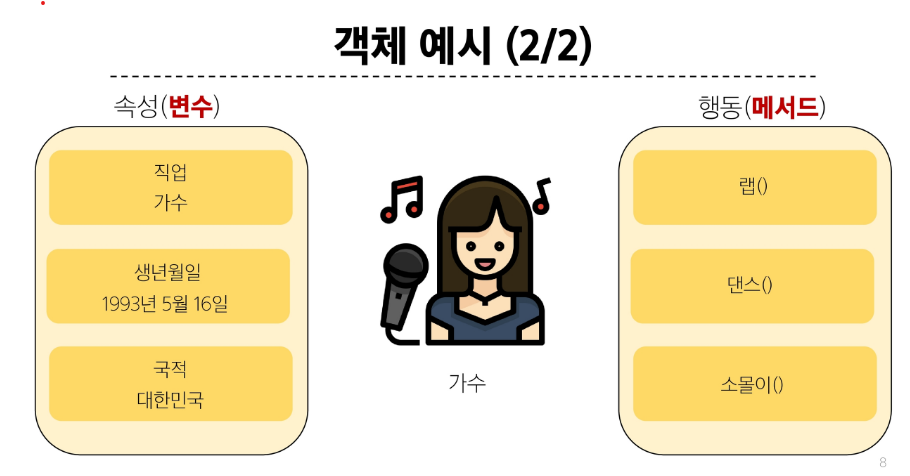
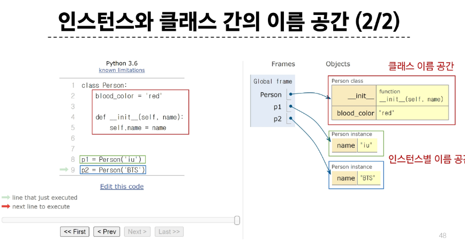
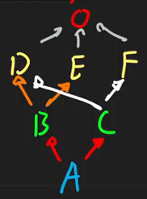

# 클래스
- 파이썬에서 타입을 표현하는 방법
- 객체를 생성하기 위한 설계도
- 데이터와 기능을 함께 묶는 방법을 제공    


# 객체
- 클래스에서 정의한 것을 토대로 메모리에 할당된 것
- '속성'과 '행동'으로 구성된 모든 것
- 예시
  
  - 클래스(가수)로 만든 객체(아이유)를 인스턴스라고 부름
  - 단,아이유는 인스턴스다라고 하기엔 어려움
  - 아이유는 '가수'의 인스턴스다가 되어야 함
- 타입(type): 어떤 연산자(operator)와 조작(method)이 가능한가?
- 속성(attribute): 어떤 상태(데이터)를 가지는가?
- 조작법(method): 어떤 행위(함수)를 할 수 있는가?
- `객체(object) = 속성(attribute) + 기능(method)`

# 클래스와 객체
- `[1, 2, 3]`은 list의 인스턴스
- 하나의 객체(object)는 특정 타입의 인스턴스(instance)이다.
  - `123, 900, 5`는 모두 int의 인스턴스
  - `'hello', 'bye'`는 모두 string의 인스턴스
  - `[232, 89, 1], []`는 모두 list의 인스턴스

# 클래스 정의
- 클래스 이름은 파스칼 케이스(Pascal Case)방식으로 작성
  ```python
  class MyClass:
    pass
  ```
## 생성자 함수
- 객체를 생성할 때 자동으로 호출되는 특별한 메서드
- __init__메서드로 정의되며, 객체 초기화를 담당
- 생성자 함수를 통해 인스턴스를 생성하고 필요한 초기값을 설정
- self 생성된 인스턴스 그 자체

## 인스턴스 변수
- 인스턴스마다 별도로 유지되는 변수
- 인스턴스마다 독립적인 값을 가지며, 인스턴스가 생성될 때마다 초기화 됨 
  ```python
  # 클래스 정의
  class Person:
      blood_color = 'red'
      def __init__(self, name): # 
          self.name = name
      def singing(self):
          return f'{self.name}가 노래합니다.'


  # 인스턴스 생성
  singer1 = Person('iu')
  # 메서드 호출
  print(singer1.singing())  
  # 속성(변수) 접근
  print(singer1.blood_color)
  ```
  - 여기서는 'name'이 됨

## 클래스 변수
- 클래느 내부에 선언된 변수
- 클래스로 생성된 모든 인스턴스들이 공유하는 변수
- 위 코드에서는 blood_color

## 클래스 변수와 인스턴스 변수 
- 클래스 내의 클래스 변수 pi 클래스 변수를 변경 가능? -> No
- c1.pi = 1.15가 되긴하지만 다만 인스턴스 변수가 되는거임, 본인만의 값을 가지게 되는 거임. 
- 클래스 변수를 바꾸고 싶으면 클래스가 직접 변경하도록 해야함
- Circle.pi = 3.15로 수정해야함

# 인스턴스 메서드
- 각 인스턴스에서 호출할 수 있는 메서드
- 인스턴스 변수에 접근하고 수정하는 등의 작업을 수행
- 반드시 첫 번째 매개변수로 인스턴스 자신(self)를 전달받음
  - self로 꼭 작성해야하는건 아니지만 관념으로 self를 씀
  - 호출될 때는 생략 가능

 ## 인스턴스와 클래스 간의 이름 공간
 - 클래스를 정의하면, 클래스와 해당하는 이름 공간 생성
 - 인스턴스를 만들면, 인스턴스 객체가 생성되고 독립적인 이름 공간 생성
 - 인스턴스에서 특정 속성에 접근하면, 인스턴스 -> 클래스 순으로 탐색
 
  - 생성된 인스턴스 안의 blood color를 먼저 확인하고, 없으면 클래스로 가서 찾는다

# 99_MRO.py
