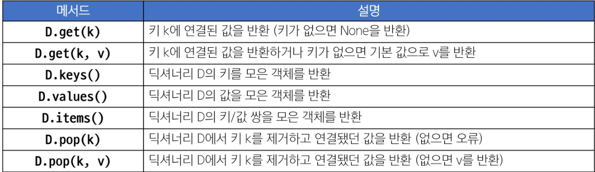

# Sequence Types
- 여러 개의 값들을 순서대로 나열하여 저장하는 자료형 (str, list, tuple, range)
1. 순서(Sequence): 값들이 순서대로 저장 (정렬x)
2. 인덱싱(Indexing): 각 값에 고유한 인덱스를 가지고 있음 / 인덱스를 사용해 특정 위치의 값을 선택하거나 수정할 수 있음
3. 슬라이싱(Slicing): 인덱스 범위를 조절해 부분적인 값 추출 가능

## str
- 문자들의 순서가 있는 변경 불가능한 시퀀스 자료형 (인덱스로 접근해서 임의로 변경 불가능)
- 문자열은 단일 문자나 여러 문자의 조합으로 이루어짐

## list
- L.pop(i): 리스트의 가장 오른쪽에 있는 항목(마지막)을 반환 후 제거 / i로 인덱스 설정 가능하지만 주로 사용하지 않음

## tuple
- 여러개의 값을 순서대로 저장하는 변경 불가능한 시퀀스 자료형
- 0개 이상의 객체를 포함하며 데이터 목록을 저장
- 데이터는 어떤 자료형도 저장할 수 있음
- 개발자가 직접 사용하기 보다는 '파이썬 내부 동작'에서 주로 사용됨

## range
- 연속된 정수 시퀀스를 생성하는 변경 불가능한 자료형
- 증가 값이 없으면 1씩 증가
- 증가 값이 음수이면 감소 / 증가 값이 양수이면 증가
- 증가 값이 0이면 에러

# Non-sequence Type
## dict
- key-value 쌍으로 이루어진 순서와 중복이 없는 변경 가능한 자료형
- key는 변경 불가능한 자료형만 사용 가능(str, int, float, tuple, range ...) / key값은 기본적으로 중복이 안됨
- 순서가 있는 dictionary -> ordered dictionary
- value는 모든 자료형 사용 가능


## set
- 순서와 중복이 없는 변경 가능한 자료형
- 수학에서의 집합과 동일한 연산 처리 가능
- 합집합: |
- 차집합: -
- 교집합: &
- 순서가 없으므로 `s.add(x)`, `s.remove(x)`

# 복사
- 변경 가능한 데이터 타입의 복사
  ```python
  a = [1, 2, 3, 4]
  b = a
  b[0] = 100

  print(a) # [100, 2, 3, 4]
  print(b) # [100, 2, 3, 4]
  ```

## 할당
- 리스트 복사 예시
  - 할당 연산자(=)를 통한 복사는 해당 객체에 대한 객체 참조를 복사

## 얕은 복사
- 리스트 얕은 복사 예시
  ```python
  a = [1, 2, 3]
  b = a[:]
  print(a, b) # [ 1, 2, 3] [1, 2, 3]

  b[0] = 100
  print(a, b) # [1, 2, 3] [100, 2, 3]
  ```
  - 슬라이싱으로 생성된 객체는 원본 객체와 독립적으로 존재

- 얕은 복사의 한계: 2차원 리스트와 같이 변경 가능한 객체 안에 변경 가능한 객체가 있는 경우
  ```python
  a = [1 ,2 ,[1,2]]
  b = a[:]
  print(a, b) # [1, 2, [1,2]] [1, 2, [1,2]]

  b[2][0] = 100
  print(a, b) # [1, 2, [100, 2]] [1, 2, [100, 2]]
  ```
  - a, b의 주소는 다르지만 내부 객체의 주소는 같기 때문에 함께 변경됨

## 깊은 복사
- 내부에 중첩된 모든 객체까지 새로운 객체 주소를 참조하도록 함
- list.copy()

# 연산자
## 비교 연산자
- `== / !=` vs `is / is not` 
  - 메모리 내에서 같은 객체를 참조하는지 확인할때는 `is / is not`
  - `== / !=`는 동등성 확인

## 단축평가
- 논리 연산에서 두 번째 피연산자를 평가하지 않고 결과를 결정하는 동작
- a를 평가했을 때 false인 경우, 뒤에 것은 연산조차 하지 않는다.

## 멤버십 연산자
- 특정 값이 시퀀스나 다른 컬렉션에 속하는지 여부를 확인
- `in` `not in`

# 반복문
## 반복문 제어 키워드
- break: 반복을 즉시 중지
- continue: 다음 반복으로 건너뜀
- pass: 아무런 동작도 수행하지 않고 넘어감

# 매개변수와 인자
## Arbitrary Argument Lists (임의의 인자 목록)
- 정해지지 않은 개수의 인자를 처리하는 인자
- 함수 정의 시 매개변수 앞에 '*'를 붙여 사용하며, 여러 개의 인자를 tuple로 처리
- 함수 정의 시 매개변수 앞에 '**'를 붙여 사용하며, 여러 개의 인자를 dictionary로 묶어 처리

## 함수 인자 권장 작성 순서
- 위치 -> 기분 -> 가변 -> 가변 키워드
- 호출 시 인자를 전달하는 과정에서 혼란을 줄일 수 있도록 함
- 단, 모든 상황에 적용되는 절대적인 규칙은 아니며, 상황에 따라 유연하게 조정될 수 있음
```python
def func(pos1, pos2, defaul_arg='default', *args, **kwargs):

```

# Packing & Unpacking
- Packing: 여러 개의 값을 하나의 변수에 묶어서 담는 것, 변수에 담긴 값들은 튜플 형태로 묶임
  - '*'을 활용한 패킹
  - *b는 남은 요소들을 리스트로 패킹하여 할당
    ```python
    numbers = [1, 2, 3, 4, 5]
    a, *b, c = numbers

    print(a) # 1
    print(b) # [2, 3, 4]
    print(c) # 5
    ```

- Unpaking: 패킹된 변수의 값을 개별적인 변수로 분리하여 할당하는 것, 튜플이나 리스트 등의 객체의 요소들을 개별 변수에 할당
  - '*'을 활용한 언패킹
    ``` python
    def my_function(x, y, z):
      print(x, y, z)

    names = ['alice', 'jane', 'peter']
    my_function(*names) # alice jane peter
    ```
    