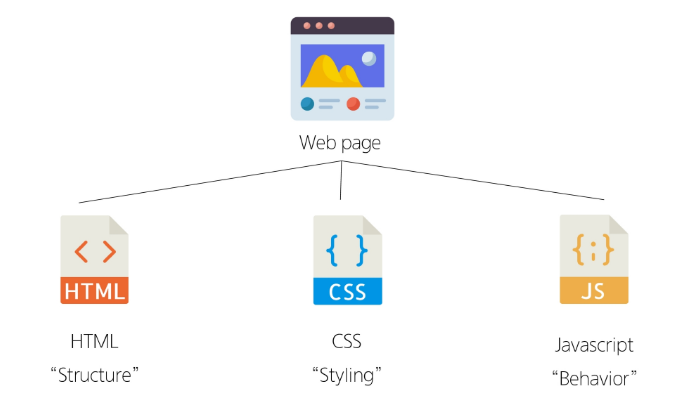
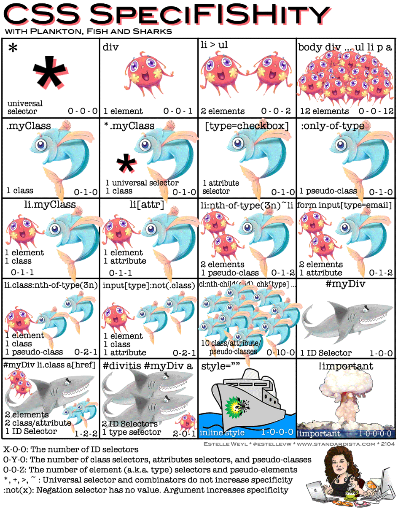

# Web
## Web site
인터넷에서 여러 개의 Web page가 모인 것으로, 사용자들에게 정보나 서비스를 제공하는 공간

## Web page
HTML, CSS 등 웹 기술을 이용하여 만들어진 'Web site'를 구성하는 하나의 구성 요소
- 구성요소   
     
  
## HTML
- HyperTextMarkup Langauge, 웹 페이지의 의미와 구조를 정의하는 언어
- HyperText: 웹 페이지를 다른 페이지로 연결하는 링크, 참조를 통해 사용자가 한 문서에서 다른 문서로 즉시 접근할 수 있는 텍스트
- Markup Langauge: 태그 등을 이용하여 문서나 데이터의 구조를 명시하는 언어
- 웹 페이지 상 번역 페이지에서 영 -> 한 으로 넘어갈 수 있게 인식 가능 
  ```html
  <html lang='en'>
  ```
- 링크 첨부 시 작은 이미지와 함꼐 정보가 나타나는 것(ex. 카카오톡)
  ```html
  <head>
    <meta> charset='UTF-8'
    <title>My page</title>
  </head>
  ```

## HTML Attributes(속성)
- 사용자가 원하는 기준에 맞도록 요소를 설정하거나 다양한 방식으로 요소의 동작을 조절하기 위한 값
- 목적
  - 나타내고 싶지 않지만 추가적인 기능, 내용을 담고 싶을 때 사용
  - CSS에서 스타일 적용을 위해 해당 요소를 선택하기 위한 값으로 활용됨

## HTML Attribute 작성 규칙
- 소문자로 작성해야한다. (다소문자 구분x)
- 속성은 요소 이름과 속성 사이에 공백이 있어야 함
- 하나 이상의 속성들이 있는 경우엔 속성 사이에 공백으로 구분함
- 속성 값은 열고 닫는 따옴표로 감싸야 함
- 주로 '-' 을 사용함 (케밥케이스)
- 문서 작성시 vscode에서 !+TAB하면 기본 구조 만들어 줌
- alt + b: 브라우저 바로 오픈

## CSS 
## CSS Selectors 종류
- 기본 선택자
  - 전체(*) 선택자
  - 요소(tag) 선택자
  - 클래스(class) 선택자 ('.'(dot))
    - 주어진 클래스 속성을 가진 모든 요소를 선택
  - 아이디(id) 선택자
    - 주어진 아이디 속성을 가진 요소 선택
    - 문서에는 주어진 아이디를 가진 요소가 하나만 있어야 함
  - 속성(attr) 선택자 등

- 결합자 (Combinators)
  - 자손 결합자 (" "(space))
  - 자식 결합자 (">")

## Specificity (명시도)
- 결과적으로 요소에 적용할 CSS 선언을 결정하기 위한 알고리즘
- 명시도가 높은 순
  1. Importance   
    - `!important`: 다른 것 다 무시 후 이것이 가장 먼저 적용 (극단적) -> 단, 디버깅할 때 활용하면 좋음
  2. Inline 스타일 (사용하지 않는 편이 좋음)
  3. 선택자
   - id 선택자 > class 선택자 > 요소 선택자
  4. 소스 코드 선언 순서 (Cascading)
  5. 상속 받은 특성  




## CSS 속성 2가지 분류
- 상속되는 속성
  - Text 관련 요소 (font, color, text-align), opacity, visibility 등
- 상속되지 않는 속성
  - Box model 관련 요소 (width, height, border, box-sizing ...), position 관련 요소(position, top/right/bottom/left, z-index) 등

  ## CSS Box Model
  - 웹 페이지의 모든 HTML 요소를 감싸는 사각형 상자 모델
  - 원은 네모 박스를 깎은 것
  - 박스 타입
    - 1. Outuer display type
    - 2. Inner display type

## Outer display type - block 특징
- 항상 새로운 행으로 나뉨
- width height 속성 사용 가능
- padding, margin, border로 인핸 다른 요소를 상자로부터 밀어냄
- width 속성을 지정하지 않으면 박스는 inline 방향으로 사용 가능한 공간을 모두 차지함 (상위 컨테이너 너비 100%로 채우는 것)
- 대표적인 block 타입 태그 (h1~6, p, div)
