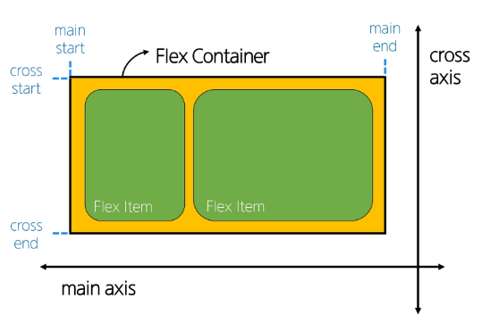

# Outer display type - inline 특징
- 새로운 행으로 넘어가지 않음
- width, height 속성을 사용할 수 없고, 부모 요소의 높이(heigth)를 따라가고, 너비는 안에 있는 컨텐츠에 따라 바뀜 
 -  너비는 가변형(내 컨텐츠 양 옆에 padding, margin을 가지는 것은 설정할 수 있음), 높이는 불변형(부모를 따라감) 

# Shorthand 속성 - 'border'
- border_with, border-style, border-color를 한번에 설정하기 위한 속성
- 작성 순서를 상관 없음 (영향을 주지 않음)

# 'none'
- 요소를 화면에 표시하지 않고, 공간조차 부여하지 않음
- 사용자에게는 보이지 않아야하는데, 렌더링은 필요할때 (요소가 필요하지만 사용자가 볼 필요는 없을때)

# CSS Position
## CSS Layout
- 각 요소의 위치와 크기를 조정하여 웹 페이지의 디자인을 결정한느 것
- Display, Position, Flexbox 등

## CSS Position
- 요소를 Normal Flow에서 제거하여 다른 위치로 배치하는 것
- 다른 요소 위에 올리기, 화면의 특정 위치에 고정시키기 등

## Position 유형
1. static : default 좌상단
2. relative
3. absolute
4. fixed
5. sticky
  - div 자식들로 묶여 있음
  - 부모 요소를 벗어날 수 없음

## z-index
- 요소의 쌓임 순서(stack order)를 정의하는 속성
- 정수 값을 사용해 z축 순서를 지정
- 같은 부모 내에서만 z-index 값을 비교
- 값이 클수록 요소가 위에 쌓이게 됨
  - 단, 항상 그런 것은 아님. 자식 값말고 부모 인덱스가 있으면 부모 인덱스를 비교해서 높은 게 올라감 
  - 즉, 부모의 z-index가 낮으면 자식의 z-index가 아무리 높아도 부모보다 위로 올라갈 수 없음
- static이 아닌 요소에만 적용됨
- z-index 값이 같으면 HTML 문서 순서대로 쌓임

# CSS Flexbox
## Inner display type
- 부모에게 부여해서 박스 내부의 자식 요소들을 어떻게 배치할지를 결정
- 요소를 행과 열 형태로 배치하는 1차원 레이아웃 방식
    
  - main axis(주축): flex item들이 배치되는 기본 축, main start에서 시작하여 main end 방향으로 배치(기본 값)
  - cross axis(교차축): main axis에 수직인 축, cross start에서 시작하여 cross end 방향으로 배치(기본 값)

# 마진 상쇄 Margin collapsing
- 두 block 타입 요소의 margin top과 bottom이 만나 더 큰 margin으로 결합되는 현상
  - Margin collapsing 이유
    - 복잡한 레이아웃에서 요소 간 간격을 일과 되게 유지하기 위함
    - 요소 간의 간격을 더 예측 가능하고 관리하기 쉽게 만듦
    - 일과성, 단순화 