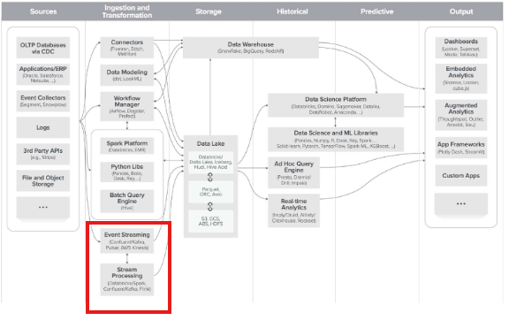
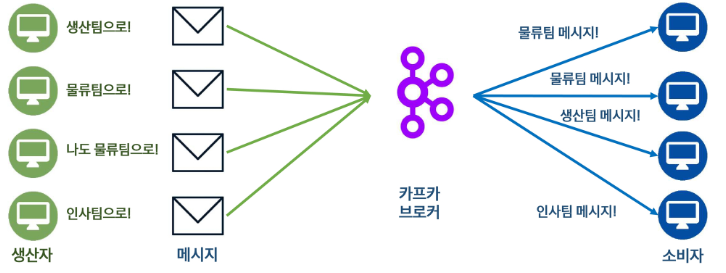
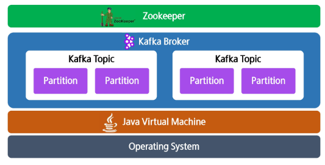
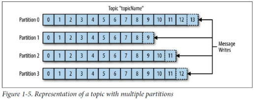

# **Kafka란?**
## 📌 메시징 시스템이란?
**어플리케이션간 데이터를 교환하는 비동기적 방식 데이터 전송 시스템**
- 메시지를 생산하는 생산자(Producer), 관리하는 브로커(Broker), 소비하는 소비자(Consumer)로 구성
- 간혹 브로커가 없는 경우도 있음 (RedisPub/Sub, ZeroMQ 등)

**메시징 시스템의 특징**
- 안정적인 구조: 비동기적 방식이라 시스템간 결합이 느슨함
  - 주는대로 받아야하고 받을 준비가 되어야함, 하지만 주거나 받는 쪽 중 하나만 문제가 생겨도 이슈 발생
- 뛰어난 확장성: 브로커만 추가하면 성능이 선형적으로 증가
  - 분산구조
  - 메시지를 주고 받는 시스템에서 사용자가 늘어나면 -> 브로커가 추가되면 각 브로커가 감당할 데이터 양이 줄어들게 됨 -> 컴퓨팅 리소스 줄이고 확장 축소가 유연함

## 📌 Kafka의 역할
- 카프카는 데이터 처리에 적합한 분산형 메시징 시스템

  - **분산형** : 단일 처리가 아니라 여러대의 서버가 업무를 나눠서 처리 (하나가 과부화되어도 다른 서버가 처리 가능) -> 시스템 성능/안정성 확보 가능
  - **카프카 브로커(Broker)**: 카프카의 메시지를 관리하는 서버
  - **토픽(Topic)**: 카프카의 메시지를 관리하는 논리적 단위. 카테고리라고 보면 됨. (택배를 찾을 때 주소 같은 느낌)
  - **파티션(Partition)**: 토픽을 이루는 저장 단위. 파티션 기반으로 병렬 처리가 이루어짐 (큐와 유사함, 택배 창고 같은 느낌)
  - **클러스터(Cluster)**: 함께 동장하는 Kafka 서버 집단

- Ingestion and Transformation
  - 빠르게 수집(실시간데이터 처리)의 허브

- kafka는 스트리밍형 데이터 수집에 뛰어난도구
- 스트리밍형 데이터 수집: 지속적으로 발생되는 데이터를 즉각 수집 및 처리 (금융 데이터, 센서 값, 실시간 로그 등)

## 📌 Kafka의 장점
카프카를 쓰는 이유
- 고성능: 초당 수백만개의 메시지 처리 가능
- 확장성: 분산 구조로 인해 뛰어난 확장성
- 내결함성: 백업본을 관리와 모니터링을 통한 안정적인 장애 복구
- 메시지 유지: 메시지를 장기간 보관 가능 -> 데이터를 다시 읽는 것도 가능
- 이벤트 기반 구조: 여러 유저가 같은 데이터 읽기 가능
  - 하나의 메시지를 여러 consumer가 읽을 수 있음 
  - 독립적으로 읽을 수 있기 때문에 같은 팀이라도 다른 그룹이 특정 토픽에 대해 읽어올 때 마다 어떤 지점까지의 데이터를 읽었는지를 알 수 있으므로 어느시점에서 가져와야하는지 여러 유저가 데이터를 읽으면서도 독립성을 유지할 수 있다   

# **Kafka의 기본 구조 및 동작 원리**
## 📌 Kafka의 핵심 개념
- 생산자(Producer): 메시지를 브로커에 전송
- 소비자(Consumer): 브로커에서 메시지를 소비
- 브로커(Broker): 중개 & 저장 역할

- Zookeeper: Kafka의 클러스터를 관리해주는 분산 관리 시스템

- 운영 체제 위 > JVM 위 > Kafka Broker 실행 위> Zookeeper(관리/조율)
  - 어떤 브로커가 어떤 파티션을 맡는지, 새로운 브로커가 들어오면 어떻게 분배를 할지 관리 감독 하는 역할을 하며 클러스터 자체의 상태를 체크하는 역할

- Leader가 메인이고 같은 데이터가 각각의 브로커에 나눠져있음
- 복제본이 하나씩 있는 것 (Replicate)
- Producer가 토픽에게 데이터를 보낼 때, leader 파티션에 기본적으로 보내고, 그 데이터가 복제가 됨
- Partion이 하나면, Producer가 여러개여도 해당 partion에 순차적으로 기록될 것이므로 처리량이 낮아짐 (데이터 안정성)
- 데이터 안정성을 위해 Replicate 활용
- 하나가 장애가 나도, 다른 복제본에서 처리 가능

## 📌 Kafka의 토픽과 파티션

- 토픽(Topic): 메시지를 저장하는 논리적 단위, 택배를 찾을 때 주소 같은 느낌
- 파티션(Partition): 메시지를 병렬로 처리하기 위한 단위, 택배 창고 같은 느낌
  - **파티션 내의 데이터 순번은 보장하지만 전체 topic 내에서는 보장되지 않는다. 트랜젝션, 순서가 중요한 시스템 XX**
- 오프셋(Offset): 파티션의 데이터를 가리키는 숫자
  - 메시지의 순번같은 느낌 (어디까지 consumer가 읽었는지 추적하는 수단이 됨)

## 📌 Kafka의 저장방식
- 물리적인 위치는?
  - RAM: 빠른 속도 / 작은 용량 / 비싼 가격 / 불안정 / 전원을 끄면 사라짐
  - DISC: 큰 용량 / 저렴한 가격 / 안정적 / 느린 속도
    - append-only: 최대한 빠른 속도로 순차쓰기 !

- Segment 파일
  - 세그먼트: 파티션이 실제로 저장되는 물리적 단위. 파일 형태
  
  - 디스크 저장 시 파일 정리가 쉽다 
  - 순차적 삭제도 유리
  - 파일 수정 속도 최적화
  - 메시지 탐색 속도 향상

  
# **Kafka의 클러스터 구조 및 데이터 분산**
## 📌 Kafka 클러스터
- 동시에 더 많은 데이터를 처리할 수 있음 (High Throughput)
- **높은 Throughput**: 동시에 더 많은 데이터를 처리할 수 있음
  - 하나의 브로커에만 데이터를 넣으면 병목현상이 발생할 수 있음
  - 브로커가 Topic으로 나누고, 또 내부에 Partition으로 나눔
- **데이터 안정성**: 복제를 통해 데이터 유실률을 낮춤 (Leader, Follower 구조로 구성)
  - 하나의 partition이 여러개의 leader와 follower(직접 통신하지는 않는다)로 구성됨
- **고가용성**: 하나의 브로커감 문제가 생기더라도 전체 시슽메은 멈추지 않음

- 클러스터 전체 상태 파악을 위해 공통적 메타데이터를 중앙에서 관리해야함(브로커, 토픽, 토픽 별 파티션)
- 이런 것들을 Zookeeper가 함
- **분산 시스템 아키텍처**: 네트워크 트래픽, 디스크 용량, 다중 모니터링 시스템 등 고료하여 설계 필요

## 📌 Kafka와 Zookeeper
- 코디네이션 서비스 시스템: Zookeeper처럼 분산 시스템 관리를 도와주는 시스템
- 역할
  - 공용 리소스 관리 (브로커들이 공통으로 사용해야하는 리소스/데이터 관리)
  - 노드 Healthcheck: 카프카의 브로커(노드/서버)들이 정상 동작중인지 확인
  - 브로커 및 파티션 관리: 메인이 파티션인 Leader 선출 및 메인 브로커인 Controller 선출을 도움

## 📌 Kafka의 컨트롤러
- 컨트롤러(Controller): 클러스터 관리 및 장애 처리 역할 수행
  - 클러스터 내부에서 동작하는 것을 조율하는 것 (팀장)
  -  Zookeeper는 외부에서 클러스터를 관리 (외부 관리인)
  

## 📌 Kafka의 리더와 팔로워
- 레플리카(Replica): 파티션 데이터를 보존하기 위해 복사본을 두는 것
- 리더(Leader): Producer, Consumer와 통신하는 메인 파티션
- 팔로워(Follower): 리더의 데이터를 실시간으로 복사해서 가지고 있는 파티션

**Kafka의 리더 선출 (Zookeeper, Controller가 기여)**
- Zookeeper와 Controller가 결정
- 선호 리더(Prefered Leader): 파티션별로 가장 선호하는 리더, 기본적으로 [Round Robin](https://yoons2owo.tistory.com/27)
  - Round Robin: 장애가 나면 Round Robin으로 실행되지 않음
- 처음에는 선호 리더에 맞추어 리더가 결정됨
- 리더 선출(Leader Election): 기존 리더 브로커가 사망했을때 다음 리더를 뽑는 것
- ISR(In-Sync Replica): 리더와 완전히 같은 값을 가진 팔로워
  - 팔로워 중 ISR이 없는 경우 ISR이 나타날때까지 기다림 (혹은 리더가 복구)
  - unclean.leader.election.enable = true 옵션 사용시 그나마 가장 최신 데이터를 가진 팔로워가 리더가 됨 (데이터 정합성이 감소)
    - 브로커가 복구된다해도 팔로워도 참여
  - 카프카는 리더의 데이터를 절대적으로 신뢰