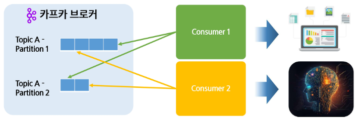
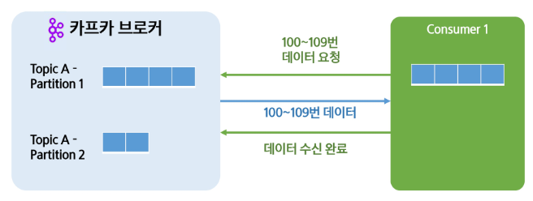
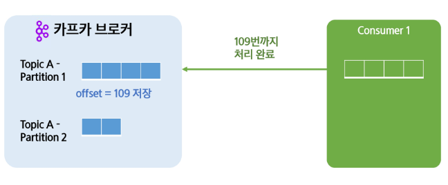
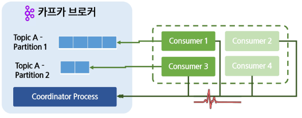
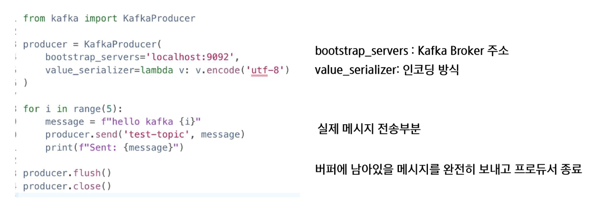

# **Kafka Consumer**
## 📌 Kafka Consumer란?
- 컨슈머(Consumer): Kafka Topic의 데이터를 읽는 역할을 수행, 이를 구독(Subscribe)라고도 칭함
- 배치하기 ETL 과정을 통해 적재, 혹은 실시간으로 데이터를 가져와 처리

## 📌 Kafka Consumer 기본 용어
- 컨슈머 랙(Consumer Lag): 프로듀서가 넣은 최신 메시지의 Offser과 컨슈머가 읽고 있는 Offset의 차이 (아직 못 읽은 메시지 얼마나 쌓여있는가? 시스템이 실시간으로 잘 처리하냐, 병목이 있냐 없냐를 볼 수 있는 지표)
- record-lag-max: 가장 높은 파티션의 랙

  -  이 그림의 경우 record-lag-max는 3임!(Partition 0, 3이 모두 3이므로)

## 📌 Kafka Consumer 특징
- Polling: 데이터를 브로커가 보내는 것이 아닌 컨슈머가 먼저 요청 하는 구조 (Push가 아니라 Polling, Consumer가 주도적으로 요청하는 것)
- 멀티 컨슈밍: 하나의 토픽을 여러 컨슈머가 같이 소비할 수 있음

- 컨슈머 그룹(Consumer Group): 특정 토픽에 대해 접근 권한과 같은 목적을 가진 컨슈머의 집단
  - 컨슈머 그룹들이 독립적으로 구성 -> 독립적으로 데이터를 가져올 수 있음 -> 여러 컨슈머가 데이터를 병렬로 가져갈 수 있다 -> 목적에 따라 데이터를 처리할 수 있다

- 페치(Fetch): 컨슈머가 브로커로부터 레코드를 읽어오는 행위 (받아오는 과정까지만 fetch)
- 커밋(Commit): 특정 offset까지 처리 했다고 선언하는 행위 (fetch후 처리까지가 완료되면!)
  - 커밋 왜 중요? 
    - commit이 없으면 장애 발생시, 다시 처음부터 읽어야함. 

## 📌 Kafka Consumer의 Group Coordinator
- 코디네이터(Coordinator): Consumer 그룹을 관리하는 브로커, 컨슈머 그룹별로 지정됨
  - 백그라운드에서 실행되며 주기적으로 컨슈머의 상태 확인 (특정 컨슈머 그룹을 담당)
- Heatbeat: 컨슈머 그룹들이 정상적으로 동작중인지 확인(polling, commit 때 마다) -> 나 살아있다!
  - 일정 시간동안 기록이 없다면 리밸런싱이 필요
- 리밸런싱(rebalancing): 컨슈머 그룹의 변경이 있어 파티션을 다시 배정하는 것

## 📌 Kafka Consumer의 Rebalance란?
**Consumer Rebalance 종류**
1. 새로운 Consumer 추가 -> 기존 파티션을 일부 재할당
2. Consumer 제거 -> 남은 Consumer가 기존 Consumer의 파티션을 담당
3. 파티션 개수 변경 -> 전체 Consumer에 대한 Rebalance 발생

**Consumer Rebalance의 과정**
1. 그룹 코디네이터가 모든 컨슈머들의 소유권을 박탈하고 일시정지 시킴

2. JoinGroup 요청을 기다리고 가장 빠르게 답이 온 컨슈머를 리더로 선정
  - 리더가 어떤 파티션을 누구에게 줄 것인지 파티션 재 분배 전략을 수립
3. 리더는 재조정한 결과를 코디네이터에게 알리고 컨슈머들에게 전달

C**onsumer Partitioning**
1. RangeAssignor: 토픽별로 순서대로 나누어줌(과거 기본값)
2. RoundRobinAssignor: 모든 파티션을 보고 하나씩 고르게 나누어짐
3. StickyAssignor: 이전 할당 정보를 활용하여 최대한 비슷하게 (현재 기본값)

## 📌 Kafka Transaction
- 트랜잭션 프로듀서(Transaction Producer)
  - 프로듀서와 컨슈머가 연계해서 처리 EOS(Exactly Once Semantics)를 지키는 방법
  - 일정 단위의 메시지를 '커밋'으로 묶어 하나의 트랜잭션으로 설정
  - 일정 시간안에 트랜잭션이 커밋이 오지 않으면 트랜잭션 실패로 처음부터 다시 메시지를 받음
  - 정확히 처리하는 것이 목적 (Producer-Borker-Consumer 하나로 묶어서 모두 성공하거나 모두 실패하거나, Partition간 일관성을 보장할 수 있도록 보장하는 것)

## 📌 Python 환경에서 사용해 보기

- flush: 버퍼에 남아있는 메시지를 강제로 모두 보내는 것

- earliest: 가장 최근 부터 읽겠다 ! (<-> 가장 과거부터 읽겠다)