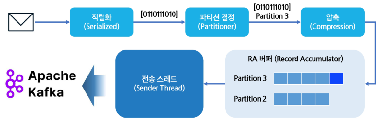
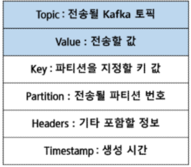
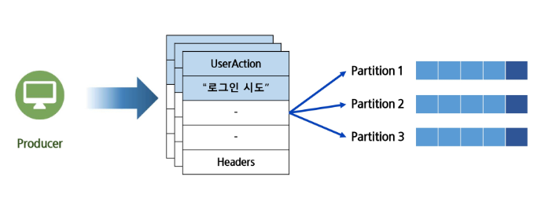
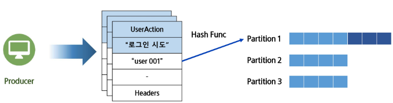
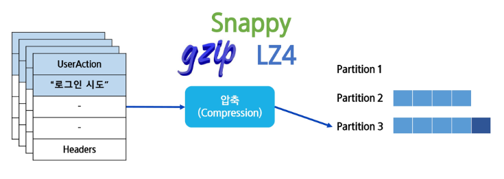
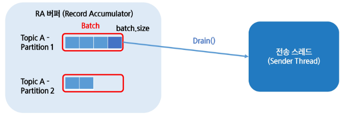

# **Kafka Producer**
## 📌 Kafka Producer란?
- 프로듀서(Producer): Kafka의 토픽으로 데이터를 전송하는 클라이언트
- 다양한 데이터 소스(로그, 사용자 이벤트, 센서 데이터)에서 메시지 생성
- Kafka Producer의 메시지 전송 과정
  - 메시지를 직렬화, 파티션 결정, 압축의 과정을 거쳐서 완성됨
  - 그 후 파티션 별 버퍼에 저장되어 있다 일정 조건(시간, 용량)을 만족하면 전송 스레드에 의해 브로커로 보내짐

  

    - 직렬화: 문자열, JSON으로 표현되는 것이 많음 -> Binary array 형태로 변환해서 처리
    - 파티션 결정: 어떤 파티션에 갈 것인지 결정 (key값이 있으면 hashing을 해서 같은 partition으로 보낸다 / Partition 내부에서만 순서를 보장하므로 ..)
    - RA 버퍼: 임시로 저장해두는 큐 (일정 시간, 혹은 데이터 양이 쌓이면 -> 전송 스레드가 Kafka로 전송)

## 📌 Kafka Producer의 메시지 구조
- Kafka Producer Record
  - 레코드: 프로듀서가 데이터를 전송하는 기본 단위
  - Topic, Value는 필수, 나머지는 선택

    

## 📌 Kafka Producer의 직렬화
- 직렬화(Serialized): 문자열같은 데이터를 단순한 Byte 형태로 바꾸는 작업
- 역직렬화(Deserialized): Byte 형태의 데이터를 다시 고수준의 원본 형태로 바꾸는 작업
- 왜?
   1. 네트워크 전송에 유리
  2. 스토리지 저장에 빠름
   3. 압축이 편리
   4. 무결성 및 복구 용이

## 📌 Kafka Producer의 파티션 선택
- Kafka 파티션 선정 알고리즘
  - RR(Round Robin): 기본 파티셔너'였'음. 파티션 지정이 없을 경우 파티션 별로 돌아가면서 저장

    

  - Key Base: 키가 결정되어 있으면 같은 키의 데이터 끼리 묶어서 처리 (순서보장을 해준다!)

    

    - 중요 제약: **사용시 파티션 수 변경 금지**
      - key hasing 한 뒤 어떤 파티션에 넘길지에 대해 저장함(ex. partion_cnt / 4), 파티션 수가 바뀌면 순서보장이 깨지게 됨. 당연히 늘이는 것 줄이는 것 모두 불가
  
  - 파티션 지정: 저장될 파티션을 지정하는 방식
    - hasing무시한다! -> hasing보다 우선순위가 높음(파티션 지정)
    

  - Uniform Sticky(현재): 기본 파티셔너. 하나의 목표 파티션을 빠르게 채우고 목표 파티션을 바꿈 (여러 메시지를 한 파티션에 넣어뒀다가 일정 조건이 되면 다른 파티션으로 이동 )
    - 같은 파티션에 몰아서 처리하는 것이 배치 측면에서 효율을 극대화할 수 있기 때문이다.
    - RA buffer에 넣어뒀다가 차면 OR 일정 시간이 지나면 -> batch로 전송 (묶어서) -> 효율 상승

## 📌 Kafka Producer의 압축
- BURFFER에 들어가기 전 압축의 단계를 거침
- 효율적인 데이터 전송 가능 (전송 속도 상승, 저장 공간 효율)
- 브로커에서 데이터 복사가 쉬움

  - gzip(가장 높은 압축, cpu 부화는 있음)
  - Snappy:빠르고 가벼운 압축 (kafka 기본)
  - LZ4: 빠르기도 하고 압축률도 괜찮은 (중간 단계)

## 📌 Kafka Producer의 버퍼

- **RA(Record Accumulator)**: 전송될 레코드를 모아두는 메모리 공간, 전송 효율을 높이는 버퍼의 역할
- **배치(Batch)**: 한번에 전송되는 레코드의 단위
- 전송스레드가 주기적으로 RA 버퍼 확인, 일정 조건이 만족되면 Drain()로 브로커로 흘려보냄
- **linger.ms**:시간 전송 조건을 통해 시간이 지나면 전송하는 형태를 만들 수 있음 (최대 이 시간만큼 기다렸다가 batch가 안차도 전송!)
- **buffer.memory**: 이 procuder가 쓸 수 있는 총 buffer memory 한도 (배치가 차지 않아도 강제 전송, 메모리가 부족해도 강제 전송)
- **PiggyBack**: 조건을 만족하지 못한 배치가 만족한 배치와 같은 브로커를 향할때 함께 보내는 최적화 기법

