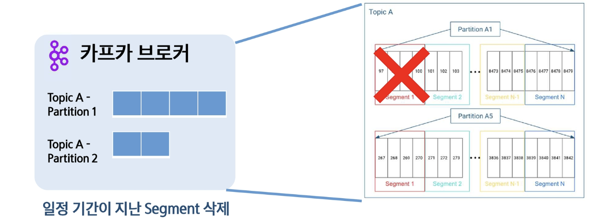
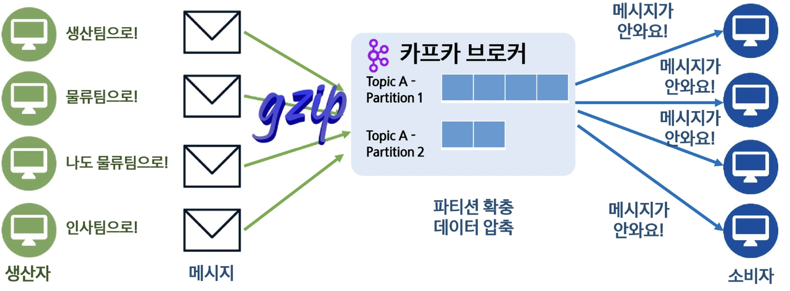
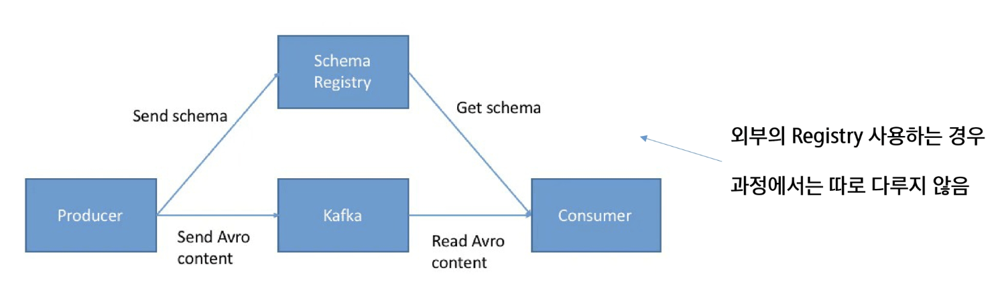

# **Kafka 최적화**
## 📌 Kafka 성능 최적화가 필요한 이유
- 대규모 트래픽 처리: 데이터의 처리량(Throughput) 및 지연(Latency) 최적화
- 안정성 개선: 데이터 손실에 대한 안정성(Durability)를 높임
  - 리더 규칙 변경, replica 증가 등의 규칙을 바꾼다! 
  - 어떻게 자원 소모를 최소화하면서 안정성있게 운영하냐에 대한 고민
  - 리더 - 팔로워 (브로커 내 파티션간 복제)
    - 하나의 브로커가 죽어도 다른 복제본이 있으므로 데이터 보관, 컨슈머 소비가 가능해짐

- 리소스의 효율적 사용: 제한된 리소스를 최대한 활용 (서버 자체를 안정적으로 사용해야함!)

  
  - (토픽 증가) 데이터의 양 많아지면-> 트랙픽 증가 -> 컨슈머 양 증가 -> 기본 설정만으로는 한계에 부딪힐 수 있음

  
- 데이터 규모가 커지면 문제가 생길 수 있고, 이때 파티션 확충 or 데이터 압축 등의 해결책을 사용할 수 있음

## 📌 Kafka 성능 최적화 주요 지표
- 프로듀서 컨슈머의 처리 속도
  - 데이터양이 증가하면 일정 수준까지는 괜찮지만 이후에는 지연될 것. -> 처리량과 치연시간이 중요 지표가 됨
- 브로커 및 주키퍼 설정
  - CPU, 메모리 사용량, 주키퍼 연결 상태나 리더 산출이 지연되는가, 내부적 병목이 어떻게 생기느냐에 대한 인프라적 요소
- 스토리지, 네트워크 등 자원 최적화
  - 디스크 IO (읽고 쓰는 것이 너무 많다), 네트워크 전송속도가 느리다.. 와 같은 것을 모니터링하고 이것을 튜닝하는 것을 모니터링 과정이라고 함

## 📌 Producer 성능 최적화
**직렬화 방식 선정**
1. StringSerializer: 단순한 문자열 직렬화(우리가 보는 데이터를 카프카가 이해할 수 있도록 Byte로 바꾸는 과정), 문자열을 UTF-8로 인코딩, 압축 효율 낮음
2. ByteArraySerializer: 데이터를 그대로 바이트(바이너리) 배열로 직렬화, 다양한 형식(텍스트 포함 이미지, 로그 등) 처리 가능, 빠른 변환 / 부족한 사용성 (디버깅이 쉽지 않음, 사람이 이해할 수 없기에)
`key_serializer, value_serializer가 서로 다른 직렬화 방식을 선택해도 된다. 단, consumer 쪽에서 deserialize 할 때도 맞춰 줘야함`
  -   성능이 중요한 경우, 압축된 것을 그대로 전달할 때 자주 사용되는 형태
3. JsonSerializer: JSON 형식으로 직렬화, 가독성 높지만 압축 효율 낮음 (구조화된 데이터를 문자열로 전달, 사람이 보기 쉽고, 다양한 데이터를 전달 가능)
4. AvroSerializer: Arvo 포멧을 사용한 직렬화, 스키마 기반, 압축 효율이 좋고 빠름 (kafka 권장 방식)

- JSON 형태로 Avro 스키마 작성 (name(int), age, email)
- 이 스키마를 Schema Registry에 저장
  - 카프카 환경에서 별도의 환경 구성 프로듀서와 컨슈머가 스키마를 공유하며 이를 기반으로 content를 주고 받음
  - 이런 경우 스키마 id만 전달하면 되므로 압축 효율이 좋음
- 이 스키마를 활용해 역직렬화까지 함

