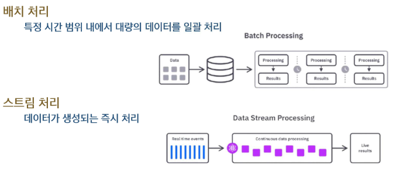
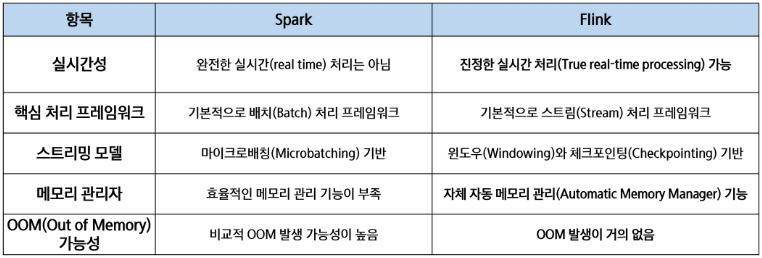
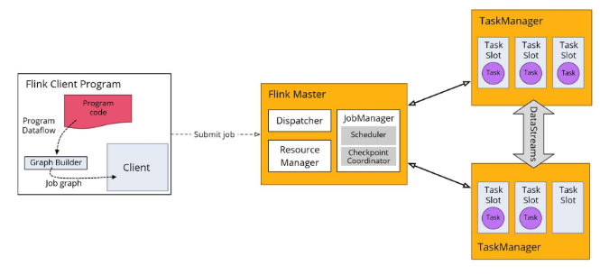
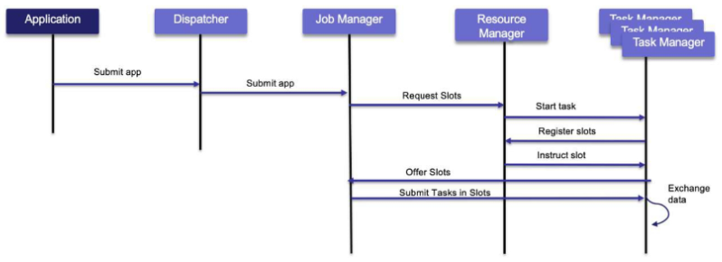
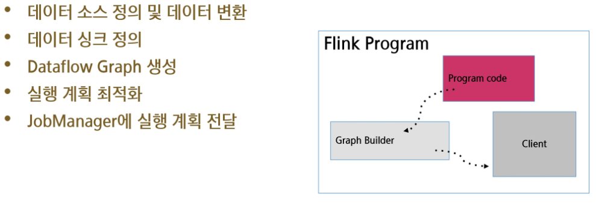
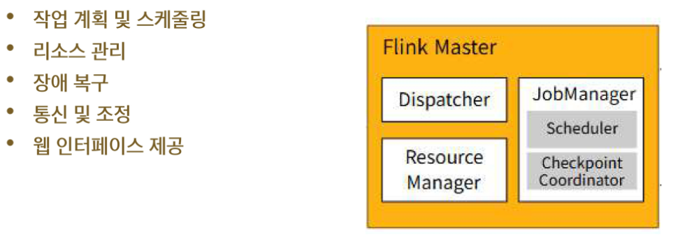
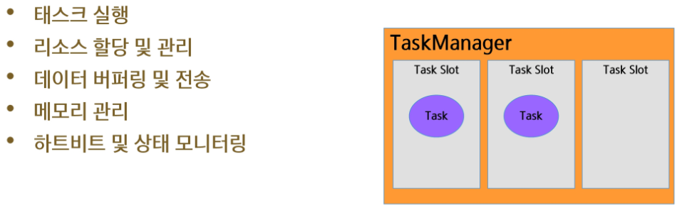
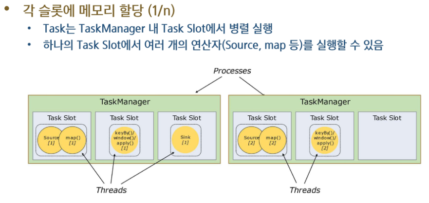
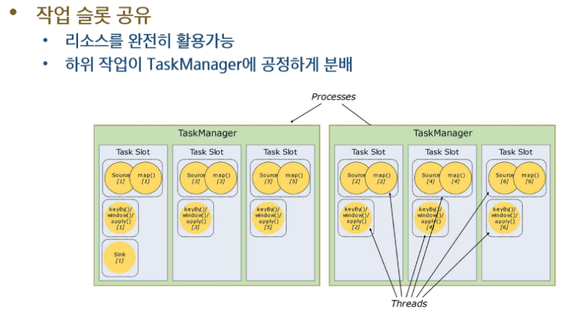

# **Flink 개요**
## 📌Flink 등장 배경
**데이터 파이프라인: 배치 방식 (Batch Processing)**
- 많은 기업들이 오랫동안 주로 ETL, 또는 ELT 방식의 배치 데이터 파이프라인을 사용

**배치 데이터 파이프라인의 장점**
- 구현 및 운영이 용이
- 안정적이고 일관된 데이터 처리
- 대규모 데이터 처리에 적합

**배치 데이터 파이프라인의 한계점**
- 실시간 대응 불가능
  - 분석 결과나 즉각적 대응이 쉽지 않다
- 지연된 데이터 품질 확인
  - 바로바로 확인하기 어렵다
- 변경 관리의 복잡성

**기존 배치 처리 시스템의 한계**
- 높은 지연 시간: 배치 처리를 데이터를 모아서 한 번에 처리
  - 데이터를 한번에 모아서 처리하니까 중간 중간에 일을 처리할 수 없음
  - 주기에 따라서 분석까지의 시간이 오래 걸린다
- 유연성 부족: 배치 워크플로우의 조정이 어려움
  - 미리 정의해둔대로 흘러가기 때문에 흐름 변경을 임의로 하기 어려움
- 오류 처리의 복잡성: 배치 처리 중 오류가 발생하면 전체 배치에 영향을 미침
- 리소서 관리 문제: 데이터 양이 증가함에 따라 배치 크기와 처리 시간도 늘어남
- 데이터 품질 관리: 데이터 검증, 정제, 변환 과정이 필요하여 배치 처리 워크플로우의 복잡성 증가

**실시간 분석을 지원하기 위한 새로운 기술 필요**
- 높은 지연 시간 -> 실시간 스트림 처리(이벤트 발생시 바로 처리), 이벤트 시간 기반 처리
- 유연성 부족 -> 배치와 스트림 데이터를 동일 API로 통합 처리
- 오류 처리의 복잡성 -> 체크포인트 기반 장애 허용, 상태 기반 연산 (현재 상태를 체크포인트로 저장하고 연산은 이 상태를 통해 이루어짐)
- 리소서 관리 문제 -> 파이프라인 병렬 처리 (작업을 분산시킨다! 분산처리)
- 데이터 품질 관리 -> 윈도우 기반 검증(2분, 3분 단위, 데이터가 겹치는지 아닌지), 스트리밍 ETL(예시: Kafka(수집) -> Flink(처리) -> ElasticSearch(적재, Kibana))

**배치 처리 VS 스트림 처리**

- Flink는 스트림이 기본이지만 배치처리로도 처리할 수 있음 (Spark 역시 기본이 배치처리이지만 Stream(Micro Batch)으로도 활용할 수 있음)

**실시간 데이터 처리 기술의 발전**
- 2010년 실시간 데이터 처리를 위해 Complex Event Processing(CEP) 기술 개발
- 트위터의 Storm, Yahoo의 S4 같은 분산 스트림 병렬 처리 시스템이 개발됨
- Google의 MapReduce와 Hadoop 프레임워크는 대용량 데이터 배치 철리와 실시간처리를 모두 지원하며 빅데이터 기술 발전을 가속화 함

## 📌Flink를 활용한 데이터 파이프라인 구조 활용
실제 스트리밍 데이터 파이프라인의 구조
- 데이터 소스에서 발생하는 실시간 이벤트를 Kafka와 같은 플랫폼을 통해 Flink로 전달
- Flink에서 데이터를 필터링하고 중복 제거, 유효성 검사, 데이터 결합 및 집계를 수행
- 최종적으로 정제된 데이터는 분석 시스템(OLAP)이나 머신러닝 모델, 모니터링 시스템, OLTP로의 전송(운영 DB)등으로 전달

## 📌Spark VS Flink

## 📌Flink 특징
**분산 스트림 처리 엔진**
- Flink는 클러스터 환경에서 분산 방식으로 데이터를 처리
- 데이터 흐름을 스트림(stream)형태로 다루며, 각 데이터를 이벤트 단위로 지속적으로 처리
- 병렬성과 확장성이 뛰어나기 때문에 대규모 데이터에 적합

**무한한 스트림 데이터를 실시간으로 처리**
- 정해진 배치(batch) 처리와 달리, Flink는 무한한 데이터 흐름을 실시간(real-time으로 처리)
- Kafka 등과 연동하여 데이터가 발생하는 즉시 처리 가능하며, 지연 시간이 매우 낮음(lov-latency)

**무한 스트림(Unbounded Streams)**
- 시작점은 있지만 끝이 정의되지 않은 스트림
- 데이터를 계속해서 실시간으로 처리해야 하며, 데이터를 모두 수집한 후 처리하는 것은 불가능

**유한 스트림(Bounded Streams)**
- 이벤트의 순서가 중요하지 않음 (유한한 데이터셋은 항상 정렬할 수 있으므로)
- 이런 유한 스트림 처리 방식은 배치 처리(Batch Processing)라고도 부름

## 📌Flink Architecture

- Program Code를 수행시킬 때 execute()호출
- 이때 Graph가 만들어지고 Job graph의 논리적 DAG(방향은 있으나 다시 돌아가지 않는 graph, 방향은 있지만 사이클은 없음)가 생성됨
  - 코드를 그래프 형태로 변환 (이런 방식으로 처리해줘!)
- 이후 Client가 Flink Master에게 Job을 제출
- **Flink Master Dispatcher**
  - Job 받으면 Job Manager에게 전달 (접수창)
  - 쪼개고 스케줄링 함!
- **Resource Manager**
  - 자원 관리 (컴퓨팅 자원을 어떻게 할당할지)
- **Job Manager**
  - 받아온 Job graph(논리적 구조)를 실제 Executioin Graph(물리적 DAG) 형태로 만들어서 각 작업을 Task Manager에게 분배
  - 작업 상태를 주기적으로 저장(Check Point, 장애 발생시 대처하기 위해)
-** Task Manager** (실행 노드)
  - 물리적 DAG로 할당 받은 일을 함
  - 각 Slot에는 하나의 병렬 작업을 수행하는 Task들이 들어감
  - Slot이 많으면 많을수록 병렬 처리가 원활하게 됨 

## 📌Flink Architecture 실행 흐름
**Program(프로그램 작성)**
- 클라이언트 시스템이 실행을 위해 제출하는, 사용자가 개발한 애플리케이션 프로그램 (Python Script)
  
**Parse and Optimize (파싱 및 최적화)**
- 이 단계에서는 코드를 파싱하여 문법 오류를 확인하고, 타입 추출(Type Extractor), 최적화 작업을 수행

**DataFlow Graph (데이터 플로우 그래프 변환)**
- 애플리케이션 작업이 데이터 플로우 그래프로 변환되어 이후 실행 단계에서 사용할 수 있도록 준비

**Job Manager (잡 매니저 처리)**
- 이 단계에서 Flink의 Job Manager 데몬이 테스크를 스케줄링하고, Task Manager에게 실행을 위임하고, 중간 처리 결과를 모니터링하는 역할도 수행

**Task Manager (태스크 매니저 처리)**
- 이 단계에서 Task Manager는 Job Manager가 할당한 작업을 실제로 실행

**시퀀스 흐름**

  

- 하나의 Task Slot에서 여러개의 연산자(Source map 등)를 개발자가 CLI등을 통해 Flink 애플리케이션 제출
- JobManager가 JobGraph -> Task Execution Graph 변환 및 병렬화
- Resource manager가 Task Slot을 할당
- TaskManager가 Task Slot에서 병렬로 데이터 스트림 처리 수행

## 📌Flink Architecture - Flink Program

## 📌Flink의 장점
- 실시간 처리 능력
  - 매우 낮은 지연시간과 높은 처리량을 제공하여 초당 수백만 개의 이벤트를 처리
- 정확한 결과 보장 (Exactly-once)
  - 체크포인트와 세이브포인트 기능을 통해 데이터 중복이나 손실 없이 정확히 한 번만 처리
- 상태 관리
  - 복잡한 이벤트 집계, 윈도우 연산, 패턴 인식을 위해 내부 상태를 효율적으로 관리
- 확장성 및 분산 처리
  - 클러스터 내 다수의 노드와 태스크 슬롯을 통해 애플리케이션을 수평적으로 확장 가능
- 유연한 API 제공
  - SQL/Table API: Flink 애플리케이션 작성 시 Bounded 및 Unbounded Streams(실시간) 모두에서 사용 가능한 선언적 고수준 API
  - DataStream API: Flink 애플리케이션 작성 시 Unbounded Streams(배치처리)에서 사용되는 고수준 API
  - DataSet API: Flink 애플리케이션 작성시 Bounded Streams에서 사용되는 더 낮은 수준의 API

