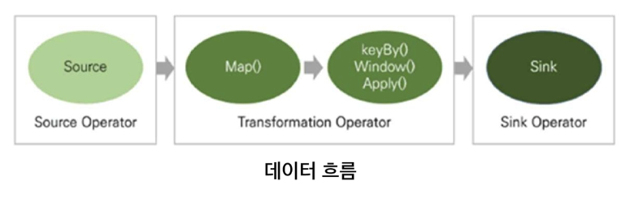
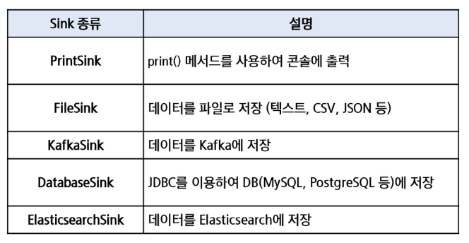
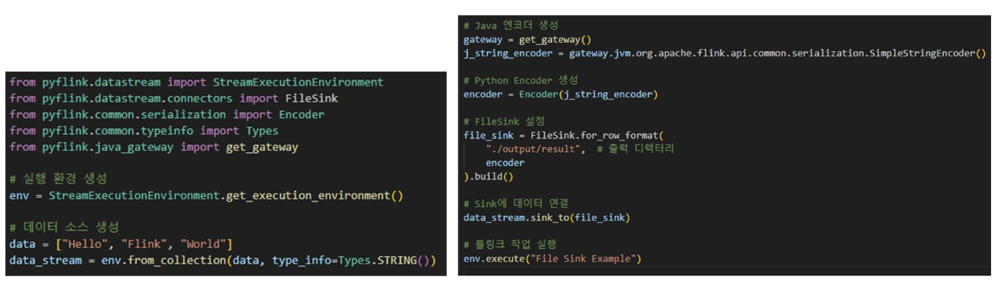
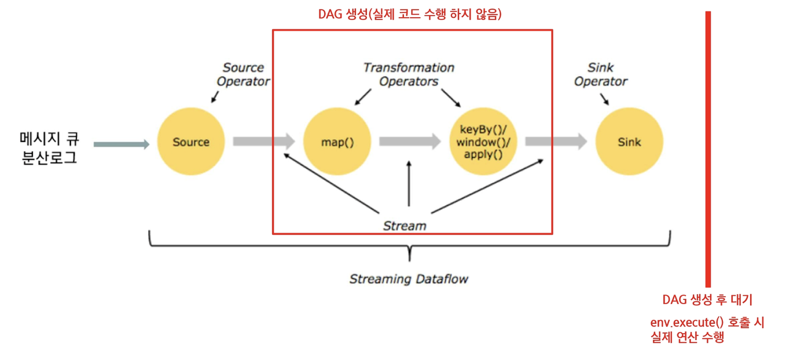
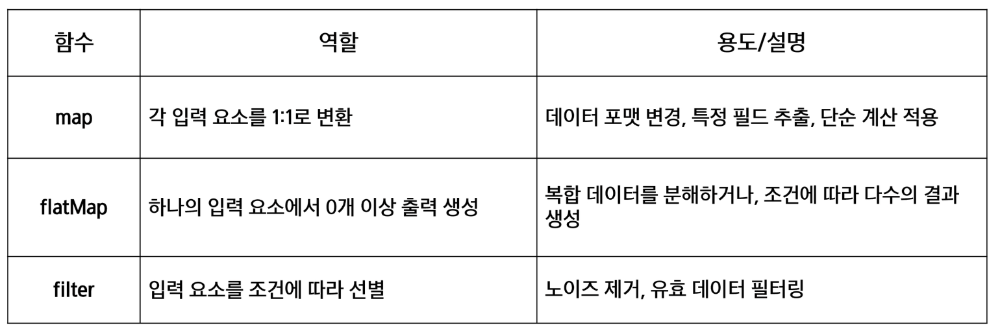
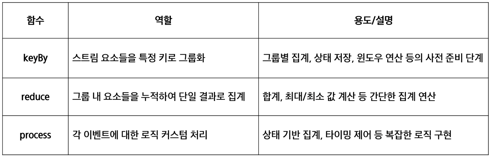
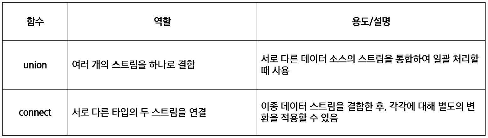
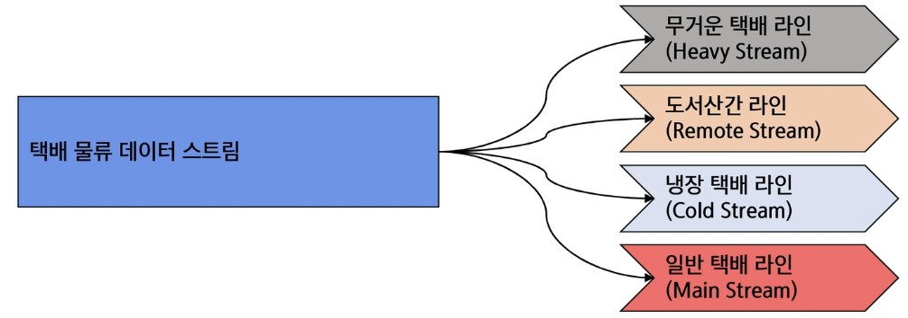

# **DataStream API**
## 📌 DataStream API 개요
**스트림 데이터를 처리하기 위한 API**
- 데이터 스트림 기본적으로 유한 또는 무한의 불변 데이터 집합으로, 변환을 통해 처리
- 실시간 이벤트 처리, CEP(Complex Event Processing), 사용자 정의 로직, 복잡한 상태 관리
- 저수준 (Low-level) API로, 데이터의 흐름과 처리를 세밀하게 제어
- 프로그램은 데이터 소스(source)로부터 데이터를 읽고, 여러 변환을 적용한 뒤 결과를 싱크를 통해 외부 시스템에 출력
- 실제 데이터 처리는 execute() 호출 시점에 실행 계획 (Data Flow Graph)으로 실행

## 📌 Directed Acyclic Graph
**논리 모델 (DAG)**
- DAG: 방향성이 있는 비순환 그래프로, 전체 계산 로직을 위한 노드(연산자)와 간선(데이터 흐름)으로 표현
- 사용자가 작성한 스트림 처리 프로그램에서 "어떤 연산을 순서대로 수행할 것인지"를 추상적으로 표현
- "연산자가 어떻게 연결되는지, 어떤 순서로 실행되는지"만을 정의

**왜 DAG를 사용하는가?**
- 스트림 처리에서 여러 연산자가 순차 혹은 병렬적으로 데이터를 처리하는 과정을 직관적으로 표현
- DAG 형태로 나누어 두면, 각 노드를 여러 태스크로 확장하여 대규모 데이터를 병렬로 처리할 수 있음
- DAG 구조를 분석해 노드 간 데이터 교환, 파티션닝, 스케줄링 등을 최적화 가능
- 엔진은 DAG에 정의된 각 노드(연산자) 상태를 주기적으로 체크포인트(checkpoint)하고, 장애 발생 시 노드 상태만 복구해 재실행 용이

## 📌 데이터 소스 종류
**파일 시스템**
- 로컬 파일, HDFS등에서 데이터를 읽어 드림

**메시지 큐/스트리밍 플랫폼**
- Apache Kafka 등과 연동하여 실시간 스트림 처리

**소켓 스트림**
- 네트워크 소켓을 통해 실시간 로그나 이벤트 데이터를 수신

## 📌 데이터 소스 구성 방법
Flink의 'StreamExecutionEnvironment'를 사용
- 커넥터 api를 통해 다양한 외부 시스템과 쉽게 연결

## 📌 Sink
**데이터 흐름: 데이터 소스 -> 연산(변환) -> Sink**
- 데이터 소스: 데이터 입력을 정의
- 연산: 데이터를 가공하는 작업
- Sink: 처리한 스트림을 출력,저장하는 단계

**Sink 예제(FileSink)**
- FileSink를 위해 JavaEncoder 필요
    - get_gateway()를 통해 Java 가상 머신에 접근, Java의 SimpleStringEncoder를 생성
    - 생성한 Java encoder를 Encoder 클래스에 전달하여 Python encoder를 생성

## 📌 데이터 변환
**데이터 변환은 원시 데이터를 유용한 정보로 변형**
- 원시 데이터를 의미있는 정보로 재구성
- 후속 처리(예: 집계, 조인, 윈도우 연산 등)를 위한 전처리 작업을 수행
- 변환 함수들은 병렬 처리에 최적화
- 각 연산은 독립적으로 실행되어 클러스터 환경에서도 높은 확장성과 내결함성을 보장

**지연 평가(Lazy Evaluation) 방식**
- 연산 계획 수립
    - 데이터 스트림에 대해 여러 변환 연산(map, filter, flatMap 등)을 적용하면, 각 연산은 바로 실행되지 않고 내부적으로 실행 계획(Graph)으로 기록

- 최적화 기획 제공
    - 실제 실행 전까지 여러 연산이 결합되어 전체 최적화가 가능해짐
    - 불필요한 중간 결과를 줄이고, 연산 체인을 병합하는 등 최적화가 수행

- 실행 트리거
    - 최종 결과를 출력하는 sink가 설정되거나 execute() 명령이 호출되면, 기록된 연산 계획에 따라 전체 데이터 플로우가 한꺼번에 실행

- 장점
    - 효율성: 불필요한 계산을 방지하여 리소스를 절약하고, 전체 실행 계획을 최적화 가능
    - 성능 향상: 여러 연산을 하나의 파이프라인으로 결합함으로써, 데이터 전송 및 중간 결과 저장을 최소화
    - 유연성: 실행 시점까지 연산을 미루어, 실행 계획을 재구성하거나 동적으로 변경

## 📌 기본 변환 함수

## 📌 그룹화 및 집계 함수

## 📌 멀티 스트림 및 결합 함수

## 📌 데이터 스트림 분할 (Filter)
**하나의 스트림에서 서로 다른 조건이나 처리 목적에 따라 데이터를 여러 개의 하위 스트림으로 나누는 작업**
- 서로 다른 처리 로직이나 파이프라인을 개별 하위 스트림에 적용
- 복잡한 데이터 처리 시 유연성을 높일 수 있음
- 초기 Flink 버전에서는 split()과 select() 연산자를 사용하여 스트림 분할
- 현재는 Filter 변환 연산 주로 사용

## 📌 데이터 스트림 반복 (Iteration)
**알고리즘을 반복 수행하여 결과를 점진적으로 개선**
- 드라이버에서 반복문을 통해 피드백 루프 구성
1. 초기설정 및 함수 정의 (단일 Job 실행 함수)
- 데이터 스트림 생성, 변환 연산 적용
- Job 실행 및 결과 수집

2. 드라이버에서 반복 로직 수행
- 반복문(While) 내에서 연산 결과 수집 및 중간 결과 출력

3. 피드백 및 종료
- 조건에 따라 반복 결과를 스트림으로 재투입
- 반복을 종료하고 최종 결과를 외부로 출력

**주의사항**
- 드라이버문에서 반복문을 통해 피드백 루프 구성

1. 종료 조건
- 무한 루프를 방지하기 위해 명확한 종료 조건이 필요
- 조건이 부적절할 시 시스템 리소스가 낭비될 가능성이 큼

2. 상태 관리
- 중간 상태가 반복적으로 업데이트되므로, 올바른 상태 관리와 체크 포인트 설정이 필수적

3. 성능 최적화
- 드라이버 반복 방식 사용시, Job 실행 오버헤드가 발생
- 반복적으로 데이터를 피드백(FeedBack)할 때, 데이터 흐름이 병목 현상이나 지연을 유발하지 않도록 설계