# **Spark** 개요 및 실행 구조
## 📌 Spark의 필요성

**실시간 데이터 처리의 필요성 증가**
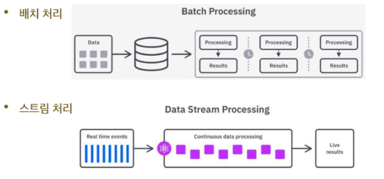
- 배치 처리: 유한! -> 끝이 있는 데이터
  - Spark도 스트리밍이 가능하지만 배치가 기본
- 스트림 처리: 무한! -> 지속적으로 들어오는 데이터

**단일 서버의 확장성 부족**
- 기존 데이터 처리는 주로 단일 서버로 이루어짐
- 데이터가 증가하면 서버 성능을 높이는 방식(수직 확장, Scale-Up)을 사용
- 그러나 단일 서버는 하드웨어의 물리적 한계로 인해 무한정 성능을 높일 수 없음

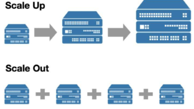

- Scale-up: CPU코어, 메모리 등을 업그레이드 시키며 확장시킴 / 하지만 한계에 도달함
- Scale-out: 서버를 여러대에 동시에 사용해서 부하를 나눔 / 분산처리 시스템 / 대용량 데이터를 여러 서버에 나누어 처리

**디스크 기반 처리로 인한 속도 문제**
- Spark 이전 기술은 데이터를 처리할 때 디스크 기반의 저장장치를 사용 (RAM 모다 느림)
- 디스크는 메모리 (RAM)보다 데이터 읽기/쓰기 속도가 현저히 느리기 때문에 데이터 처리 과정에서 속도 저하 현상이 발생
  - 디스크를 아예 안 쓰냐? No -> 보조 저장서로 활용

## 📌 Spark 탄생 배경과 설계 목적
- 기존 hadoop mapreduce는 느린 속도와 반복 작업의 비효율성이라는 구조적 한계 존재
- 특히 머신러닝, 스트리밍 분석처럼 반복적이고 실시간성이 요구되는 작업에 부적합
- Spark는 UC Berkeley AMP Lab에서 이러한 문제를 해곃하고자 개발됨

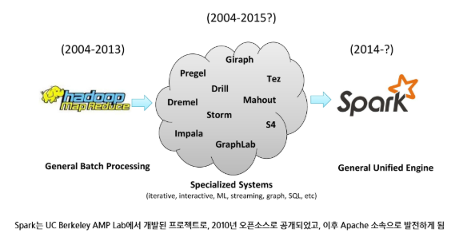
- 처리 속도가 느리고 반복작업에 있어 비효율적
- 분석할 때 다양한 요소를 고려하기가 어려웠음
- Specialized Systems를 Hadoop에 연계해서 쓰기 시작했다 ! (Haddop ecosystem)
  - 각각을 설치, 운영, 연동을 해야했음 (복잡했음)
  - 통합플랫폼이 있으면 좋겠다 ! -> 메모리 기반의 다양한 기능을 가진 연산의 Spark가 등장

## 📌 Spark가 기술의 한계를 어떻게 극복했는가?

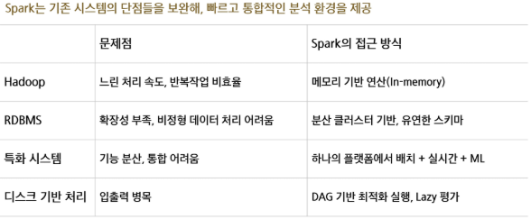

## 📌 Spark 사용의 이유
- 반복 연산에서 Haddop MapReduce보다 빠른 처리 성능
- 메모리 기반의 데이터 처리로 빠른 속도
- Hadoop과의 유연한 연동성 (기존 인프라가 하둡이어도 스파크만 붙이면 문제없이 작동 가능)
- RDD의 계보를 기반으로 장애 발생시 연산을 자동으로 재실행하여 복구
  - 장애발생시 복구하는 형태로 처리를 할 때 사용하는 것 계보

## 📌 Spark의 설계 철학
**속도**
- 메모리 기반 연산으로 디스크 I/O 최소화
- DAG 기반 스케줄링으로 병렬 처리 최적화
- Tungsten 엔진을 통한 코드 생성 최적화 (복잡한 튜닝(최적화)이 필요할때 알아서 해줌)

**사용 편리성**
- 단일 PC와 클러스터 간 코드 차이가 최소화된 추상화 구조
- RDD -> Dataframe -> DataSet의 계층적 API 제공 (저수준이냐 고수준으로 다룰거냐...)
- Scala, Python, Java, R 등 다중 언어 지원

**모듈성**
- SparkSQL, Streaming, MLlib, GraphX 등 다양한 워크로드를 하나의 엔진에서 처리
- 별도의 시스템(Hive, Storm, Mahout 등) 통합 불필요

**확장성**
- 다양한 데이터 소스(HDFS, Cassandra, MongoDB, RDBMS, S3 등 연동)
- 여러 파일 포맷(csv, parquet 등) 지원
- 수많은 시드파티 패키지와 통합 가능

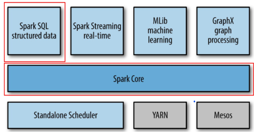
- 단순히 데이터를 분산처리하는 엔진이 아니라 다양한 컴포넌트로 구성이 되어있는 데이터 분석 플랫폼
- SparkCore: 전체 연산을 실행하고 자원을 관리하는 역할 (핵심 실행 플랫폼)
- SparkSQL: 구조적 데이터 처리 및 SQL 기반 쿼리 실행
- Spark Streaming: 실시간 데이터 분석을 위한 스트리밍 처리 (마이크로 배치 방식)
- MLlib: 머신러닝 알고리즘 라이브러리 (분류, 회기, 군집 등)
- GraphX: 그래프 기반 데이터 처리와 분석 지원 (PageRank 등)
- Core 아래 부분은 -> 스케줄러, 자원관리 시스템 (YARN, Mesos)

## 📌 Spark의 특징
- 높은 처리 성능 (메모리 기반 처리)
- Lazy Evalutation을 통한 최적화
  - Dag구조를 통해 최적화한다
- 다양한 데이터 처리 방식 지원 (배치 처리, 스트리밍 처리)
- 폭넓은 언어 지원

## 📌 Spark 활용 시 주의점
- 엄밀한 실시간 처리 불가(Micro-batch 기반)
  - 실시간도 제공'하기는' 함
- 작은 데이터 파일 처리의 비효율성
- 자체 파일 관리 시스템 부재 (HDFS, S3 등 사용)
  - 통합 플랫폼으로 구성되어서 이것저것많이 할 수 있지만 데이터 저장소는 외부를 사용함
  - Spark 만으로는 데이터 저장소 역할을 할 수 없다
- 높은 메모리 비용

## 📌 Spark 실행 구조
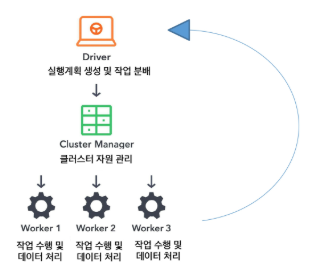

1) 클러스터 매니저(Cluster Manager)
- 자원을 조율하는 역할
- 애플리케이션의 리소스 관리
  - 드라이버가 요청한 실행기 프로세스 시작
  - 실행 중인 프로세스를 중지하거나 재시작
  - 실행자 프로세스가 사용할 수 있는 최대 CPU 코어 개수 제한 등

- 종류
  - Standalone (자체 내장 클러스터 사용)
  - Hadoop Yarn (Haddop 리소스 매니저)
  - Kubernetes

2) 드라이버 (Driver)
- 스파크 애플리케이션의 실행을 관장하고 모니터링
  - 클러스터 매니저에 메모리 및 CPU 리소서를 요청 (자원 요청)
  - 애플리케이션 로직을 스테이지와 태스크로 분할 (작업 분할)
  - 여러 실행자에 태스크를 전달 (작업 분배)
  - 태스크 실행 결과 수집 (결과 수집)
  - 1개의 스파크 애플리케이션에는 1개의 드라이버만 존재
  - 드라이버 프로세스가 어디에 있는지에 따라, 스파크에는 크게 두 가지 모드가 존재
    - 클러스터 모드 - 드라이버가 클러스터 내의 특정 노드에 존재
    - 클라이언트 모드 - 드라이버가 클러스터 외부에 존재 
    - ex. 주피터 노트북 사용 -> 드라이버는 내 컴퓨터에서 동장하는거니까 클라이언트 모드 -> ???

3) 실행기 (Executor)
- 드라이버로부터 전달받은 태스크를 실행하는 프로세스
  - 스파크 드라이버가 요청한 태스크들을 받아서 실행하고(병렬), 그 결과를 드라이버로 반환
  - 각 프로세스는 드라이버가 요청한 태스큳르을 여러 태스크 슬롯(스레드)에서 병렬로 실행
  - JVM 프로세스
    - JVM에서 실행된다, pyspark 스크립트는 연산을 실행하고 JVM이 EXECUTOR 통신할때 소켓형태로 주고 받음

4) 스파크 세션(Spark Session)

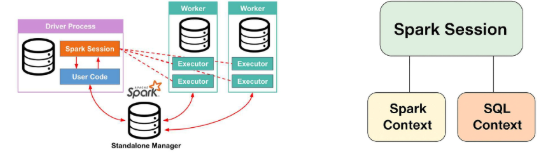

- Spark 기능(DataFrame, SQL 등)을 사용하기 위한 진입점
  - Spark Core 기능들과 상호작용할 수 있는 진입점 제공
  - API로 프로그래밍을 할 수 있게 해주는 객체
  - spark - shell에서 기본적으로 제공
  - 스파크 애플리케이션에서는 사용자가 SparkSession 객체를 생성해 사용해야 함

5) 잡 (Job)
- 사용자가 실행한 액션(collect(), count() 등)에 의해 생성되는 작업 단위
    - 액션: 코드를 호출하는 순간 LAZY EVEULATION이 적용되어 하나의 잡이 생성될 수 있도록 해주는 것
  - 스파크 액션 (save(), collect() 등)에 대한 응답으로 생성되는 여러 태스크로 이루어진 병렬 연산
- 단일 연산 X -> stage, task로 구성
  - 드라이버(실행계획) -> JOB을 stage로 나눔 -> task로 나눔(파티션과 유사) -> 실제로 task로 수행될때는 각각의 파티션 단위로 수행 됨
  - 액션 호출 -> JOB -> stage -> Task 실행
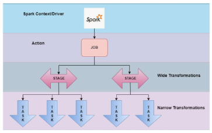

6) 스테이지(stage)
- 잡(JOB)을 셔플(데이터 이동) 기준으로 나눈 실행 단위
- 작업을 묶어서 실행하는 논리적 단위
- 스테이지 안에서는 데이터 이동 없이 순서대로 처리 but 데이터가 섞이거나 이동해야한다면 셔플이 발생 
  - 셔플이 발생하면 ? -> 스테이지가 다음 스테이지로 넘어감

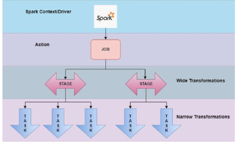
- 스테이지 분할의 기준 (Wide, Narrow)
  - Wide: 데이터가 하나로 묶여있을 때, 그대로 이어서 하나로 처리해도 될 때
  - Nattor: 데이터가 여러 노드에 흩어져있어서 재배치(셔플)가 필요한 경우 (새로운 스테이지로 이동)

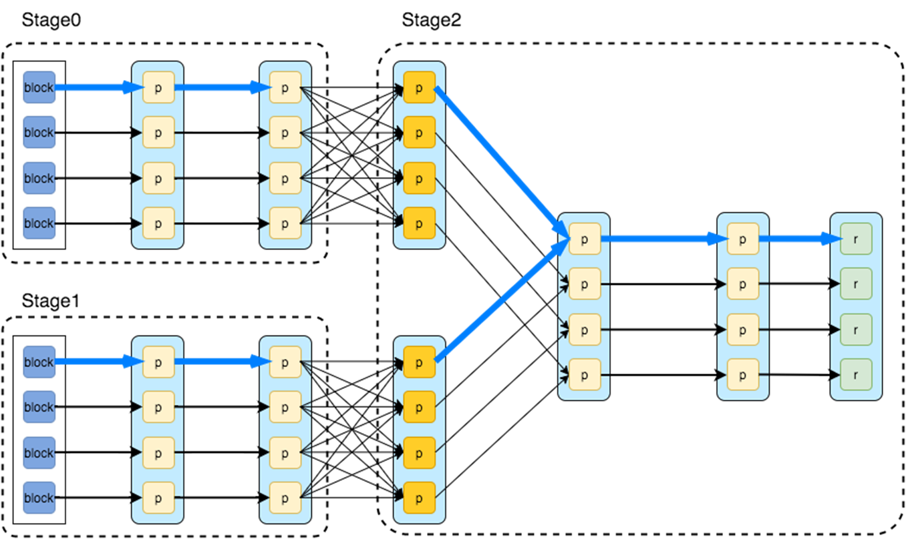
- 데이터 셔플이 이루어지는 시기에 Stage0 -> Stage 2가 됐음! 
- 스테이지는 결국 셔플 단위로 나뉘게 됨

7) 태스크(task)
- 스테이지를 구성하는 실제 실행 단위
  - 스파크 각 잡별 실행기로 보내지는 작업 할당의 가장 기본적인 단위
  - 개별 task slot에 할당 되고, 데이터의 개별 파티션을 가지고 작업
- 데이터가 10개의 파티션이면 task(executor에서 병렬로 실행됨, cpu가 4개라면 task를 동시에 4개까지 수행할 수 있음)도 10개로 생성될 것!

[📌 Spark 연산의 종류]
- 스파크 연산은 크게 트랜스포메이션(Transformation), 액션(Action)으로 구별
  - Transformation: 변환, filter, select, groupby
  - Transformation만 있으면 실행되지 않음 (lazy evaluation)
  - Action: Dag 형태의 연산 계획을 Job stage task 형태로 쪼개서 실행 시작

**Transformation**
- immutable(불변)인 원본 데이터를 수정하지 않고, 하나의 RDD나 Dataframe을 새로운 RDD나 Dataframe으로 변형
- (input, output) 타입: (RDD, RDD), (DataFrame, DataFrame)인 연산
  - map(), filter(), flatMap(), select(), groupby(), orderby() 등
- Lineage: 장애가 나면 재계산(Flink의 Checkpointing과 유사한 기능, DAG 정보를 기반으로 이 시점부터 처리하겠다라는 것을 계산해서 복구를 수행)

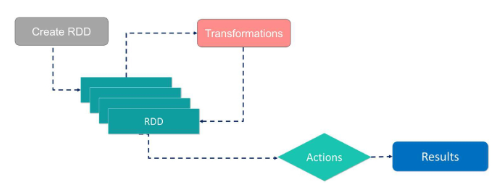

**Narrow transformation**
- input: 1개의 파티션
- output: 1개의 파티션
- 파티션간 데이터 교환이 발생하지 않음
- filter(), map(), coalesce()
- immutable -> 새로운 RDD를 만든다

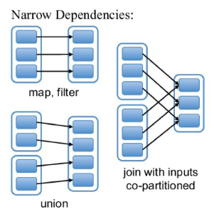

**Wide transformation**
- 연산 시 파티션끼리 데이터 교환 발생 (네트워크, 재분배, 디스크, 속도 줄고 리소스 증가의 문제가 생길 수 있음)
- groupby(), orderby(), sortByKey(), reduceByKey()
- 단, join의 경우 두 부모 RDD/Dataframe이 어떻게 파티셔닝 되어 있냐에 따라 narrow일 수도 wide일 수도 있음

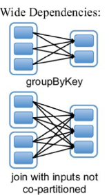

*stage 수 = shuffle 수 + 1 (시작할때 stage 0부터 시작하니까!)

8) Action
- immutable(불변)인 인풋에 대해, Side effect(부수 효과)를 포함하고, 아웃풋이 RDD 혹은 DataFrame이 아닌 연산
- count() -> output: int
- collect() -> output: array
- save() -> output: void

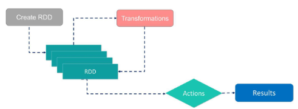

**Lazy Evaluation**
- 모든 tranformation은 즉시 계산되지 않음
- 계보(lineage)라 불리는 형태로 기록
- transformation이 실제 계산되는 시점은 action이 실행되는 시점
- action이 실행될 때, 그 전까지 기록된 모든 transformation들의 지연 연산이 수행됨
- 장점
  - 스파크가 연산 쿼리를 분석하고, 어디를 최적화할지 파악하여, 실행 계획 최적화가 가능 (eager evaluation이라면, 즉시 연산이 수행되기 때문에 최적화 여지가 없음)
  - 장애에 대한 데이터 내구성을 제공
  - 장애 발생 시, 스파크는 기록된 lineage를 재실행하는 것만으로 원래 상태를 재생성 할 수 있음
