# **Elasticsearch** 개요

## 📌 정보 검색의 핵심 기술
- 데이터 수집
    - 웹 크롤링: 웹 문서를 자동으로 수집하여 색인하는 방식
    - 스크래핑: 특정 웹사이트에서 데이터를 추출하여 가공하는 방식

- 데이터 저장 - 역색인(Inverted Index)
    - 키워드와 해당 키워드가 포함된 문서 정보를 저장하는 구조
    - 문서 검색 시 키워드 기반으로 관련 문서를 빠르게 찾아줌

- 검색 알고리즘(Search Algorithm)
    - TF-IDF: 특정 키워드가 문서 내에서 가지는 상대적 중요도를 평가하는 기법
    - BM25: TF-IDF를 개선한, 가중치 기반 검색 알고리즘으로, 검색 정확도를 높임

## 📌 Elasticsearch

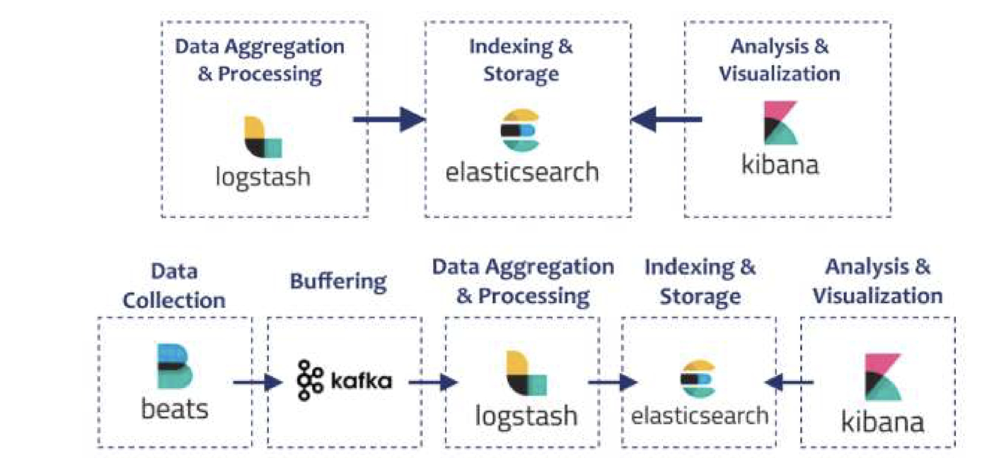

- Elasticsearch는 강력한 오픈소스 검색 및 분석 엔진
- 수평적 확장성, 안정성, 쉬운 관리를 위한 설계
- Apache Lucene 기반이며, Elastic Stack의 일부로 Elastic Stack은 Logstash(로그 수집), Beats(데이터 수집), Kibana(분석, 시각화)를 포함

## 📌 Elasticsearch와 Lucene의 관계
Elasticsearch
- 분산 검색 엔진, 데이터를 저장하고 빠르게 검색
- Lucene을 내부 엔진으로 사용

Lucene
- 검색 라이브러리, Elasticsearch의 핵심 검색 기능 담당
- Java로 작성된 고성능 텍스트 검색 엔진 라이브러리
- 검색, 색인(Indexing) 기능을 제공
- 단독으로 사용하려면 직접 애플리케이션 개발 필요

Elasticsearch vs Lucene: Elasticsearch는 Lucene을 기반으로 동작하며 REST API 및 분산 환경 지원

## 📌 Lucene이란
- 검색용 서비스의 핵심: 루씬
    - Elasticsearch에서의 검색관련 API의 대부분은 루씬 기반의 검색 API에서 출발
    - 분산처리, 캐싱, 샤드 기반 검색 등의 추가 기능을 제공하여 대규모 데이터 검색을 최적화

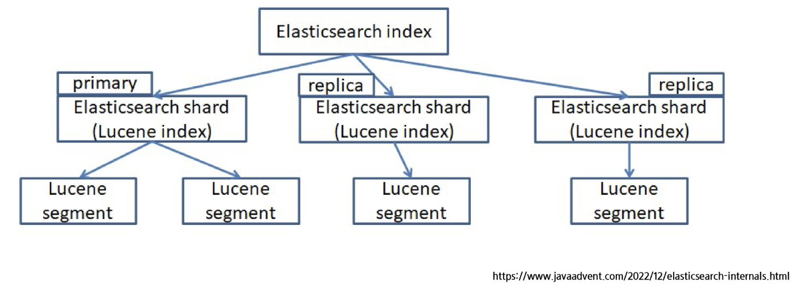

- Index: 테이블 or 카프카의 토픽과 같은 존재. 특정 주제에 대한 (document)가 담긴 것

## 📌 Lucene의 segment

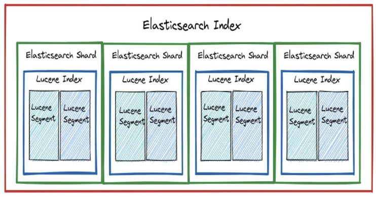

- 세그먼트(Segment)란?
    - Lucene에서 색인된 문서들을 저장하는 최소 단위
    - 하나의 샤드(Shard)는 여러 개의 세그먼트로 구성
    - 세그먼트는 한 번 생성되면 수정되지 않음 (Immutable)
        - 문서가 업데이트되면 새로운 세그먼트가 생성
        - 삭제된 문서는 "삭제 플래그"로 관리
            - 표시만 해두고 나중에 병합(merge)할 때 처리

- 세그먼트의 장점
    - 동시성 확보: 여러 세그먼트에서 동시에 검색 가능
    - 빠른 색인 처리: 기존 세그먼트를 수정하지 않고 새로운 세그먼트 추가 (수정은 시간이 오래 걸림)
    - 안정적인 검색: 검색 시 기존 세그먼트는 그대로 유지되므로, 검색 중단 없이 색인 가능

## 📌 Elasticsearch 특징
- 분산 구조
    - 클러스터 내 사용 가능한 모든 노드에 데이터를 자동으로 분산하여 준실시간으로 대량의 데이터를 처리 가능하도록 함

- 전문 검색 (Full-text Search)
    - 고급 전문 검색 기능을 지원하며, HTTP 웹 인터페이스와 스키마가 없는 JSON 문서를 사용

- 확장성
    - 수백 대에서 수 천 대의 서버로 확장 가능, 구조화된 데이터 및 비정형 데이터 수 페타바이트 규모까지 처리 가능

- 유연성
    - 다양한 소스로부터 이질적인 데이터 유형을 색인할 수 있으며, 복잡한 검색 기능 제공 (스키마가 없기 때문에, 하지만 스키마를 정하고 업무를 하는 것이 효율적이긴 함)

## 📌 Elasticsearch 활용
- 기업 검색
    - 기업에서 전체 디지털 콘텐츠를 색인하여 내부 네트워크 또는 웹사이트에서 고급 검색 기능을 제공하는 데 활용

- 로그 수집 및 분석
    - Logstash 및 Kibana와 함께 사용하여 로그 데이터를 분석하고 IT운영, 보안, 성능 모니터링에 대한 인사이트 제공

- 보안 정보 및 이벤트 관리
    - 조직에서 보안 데이터를 실시간으로 분석하고 시각화하여 위협 감지 및 규정 준수 관리에 활용

- 데이터 분석
    - 빅데이터 분석을 위해 사용되며, 대량 데이터를 빠르고 다양한 방식으로 탐색할 수 있도록 지원

- 개인화 및 추천 시스템
    - 이커머스 웹사이트 등에서 사용자의 행동과 상호작용을 분석하여 맞춤형 상품 추천 및 동적 콘텐츠 제공에 활용

## 📌 Elasticsearch의 기본 요소

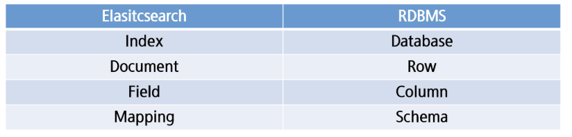

*Elasticsearch의 Index는 RDBMS의 Table과 더 유사

- 문서(Document)
    - 문서는 색인될 수 있는 기본 정보 단위
    - 각 문서는 JSON 형식으로 표현되며, 가벼운 데이터 교환 형식

- 필드(Field)
    - 필드는 Elasticsearch에서 가장 작은 데이터 단위이며 키-값 쌍(key-value pair)을 의미

- 인덱싱(Indexing)
    - 데이터를 Index 단위로 관리
    - 각 인덱스는 Database처럼 동작 (table처럼 동작)
    - 문서는 JSON 형식으로 저장되며, 검색을 위해 최적화된 형태로 변환 (text형태면 별도 처리 과정(쿼리 분석 등), Lucene은 텍스트 분석을 위해 사용)

- 샤딩(Sharding)
    - Index는 여러 개의 샤드(서버)로 나눌 수 있음 (쪼개기)
    - 데이터를 여러 노드에 분산 저장하여 성능을 향상시키고, 대용량 데이터와 높은 검색 요청을 효과적으로 처리

- 레플리카(Replica)
    - Replica Shard는 기본 샤드의 사본으로, 장애 발생 시 데이터 손실을 방지하고 검색 성능을 향상시키는 역할
    - 여러 복제본이 존재하면 검색 요청을 분산 처리할 수 있어 시스템의 안정성과 확장성이 높아짐

## 📌 Elasticsearch 검색 동작 원리
- 질의 처리(Query Processing)
    - 사용자가 질의를 입력하면, 해당 질의는 구문 분석(Parsing) 및 변환(Transforming)과정을 거쳐 Lucene 인덱스에서 검색이 가능하도록 최적화된 형식으로 변환
    - 변환된 질의는 (Index와 관련)모든 관련 샤드(기본 샤드 및 복제 샤드)에 병렬로 실행되어 빠른 검색이 가능
    - 하나의 검색어가 여러 서버에 던져지고 병렬 처리 후 합쳐서 제공

- 연관성 점수 계산(Relevance Scoring)
    - 검색 결과의 연관성을 평가하기 위해 다양한 알고리즘을 사용
    - TF-IDF(단어 빈도-역문서 빈도) 및 BM25 등의 알고리즘을 사용하여 각 문서가 사용자의 질의와 부합하는지 계산
    - 해당 점수는 검색 결과의 순위를 결정하는 데 활용

- 준실시간 검색(Near Real-Time, NRT)
    - 데이터를 검색하면서 동시에 색인할 수 있는 준실시간(NRT) 검색 기능을 제공
        - 보통 일반적으로 색인된 애들이 검색이 됨. 하지만 데이터베이스는 삽입 후 검색이 가능하려면 어느정도 시간이 필요함. 색인이 되는 시점까지 (디스크 저장) 기다려야하니까. 그럼 매번 디스크에 쓸 것이냐? 메모리 버퍼를 통해 저장된 것처럼 검색에 고려되도록 함. 이걸 주기적으로 비우며 디스크에 저장
    - 일정 주기로 버퍼를 비워 색인 세그먼트를 생성하여 빠르게 검색 가능

- 준실시간 검색이 가능한 이유
    - 메모리 기반 버퍼링으로 색인 속도 향상
    - 비동기 색인 처리로 검색과 색인을 동시에 수행
    - Lucene 엔진 최적화를 통한 빠른 색인 적용

## 📌 Elasticsearch 환경 구성
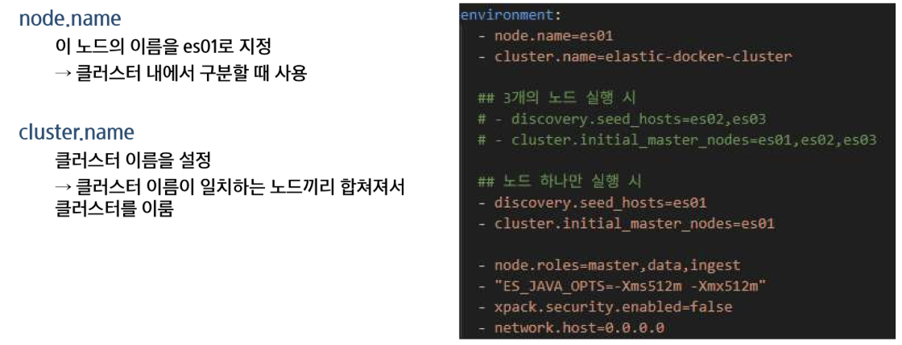

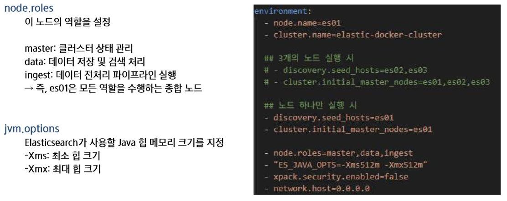

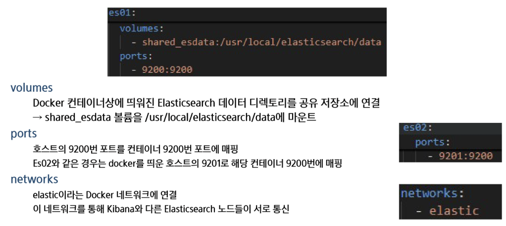

## 📌 Elasticsearch의 데이터 교환
- 방식
    - Elasticsearch는 분산 검색 및 분석 엔진으로, 대량의 데이터를 빠르게 검색하고 분석하는 데 사용
    - RESTful API를 통해 클라이언트와 통신

- REST API의 특징
    - HTTP 기반으로 동작
    - 자원을 URL로 표현(/users/1, /products/10 등)
    - HTTP 메서드를 활용하여 CRUD 작업 수행(GET(조회), POST(생성), PUT(수정 or 생성), DELETE(삭제))
    - JSON, XML 등 다양한 데이터 형식을 사용 (주로 JSON)

## 📌 Elasticsearch의 RESTful API
- HTTP요청을 통해 데이터를 처리하며, API설계를 통해 다양한 기능을 제공
- 언어 독립성, 확장성, 직관적인 인터페이스 제공 등의 장점

## 📌 Elasticsearch의 index 생성
1. Index를 Elasticsearch가 자동 매핑(dynamic mapping)으로 필드 타입을 추론해서 설정
2. 인덱스를 미리 정의된 설정으로 명시적으로 생성(mapping도 가능)

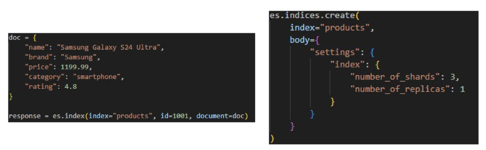

- 1개의 row = 1개의 doc -> 1개의 row를 JSON 형태로 넣는다고 생각하면 됨

## 📌 Document CRUD
**POST를 활용한 문서 생성**

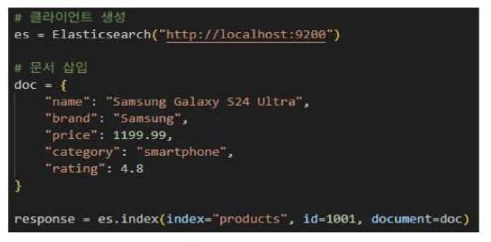

Kibana에서 뜬 결과

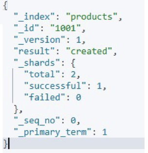

- reulst가 created: 문서가 잘 만들어졌다.
- index, id가 설정한대로 만들어졌고 version은 1번이다

**GET을 활용한 문서 조회**

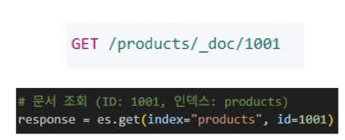

Kibana에서 뜬 결과

- found: 제대로 찾았다!

**POST를 통한 업데이트**
1. 기존 내용을 변경

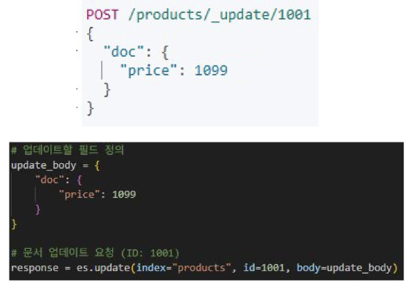

Kibana에서 뜬 결과

- version이 2가 됨

2. 새로운 필드 추가

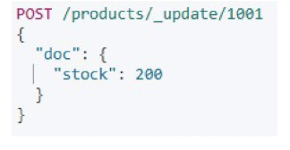
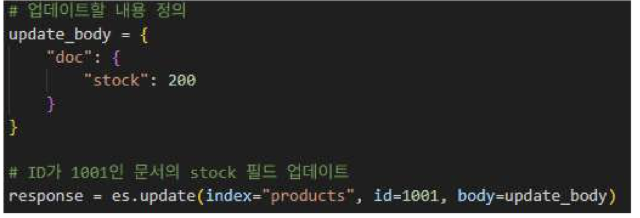

Kibana에서 뜬 결과

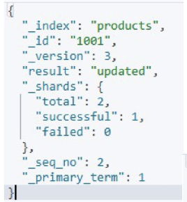

- version 바뀜
- result: updated

- 값 추가되는 것도 확인

**DELETE를 통한 삭제**
- 실제로 삭제되는 것이 아니고 표시되기 때문에 flush를 해야 완전 삭제

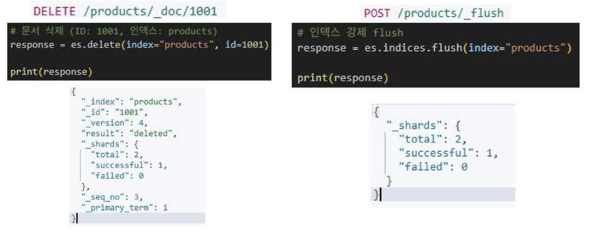

- forcemerge: 강제로 실제 디스크에 반영하여 삭제

**Upsert**
- 업데이트와 삽입을 결합한 연산
- 해당 ID의 문서가 존재 -> 업데이트 수행
- 해당 ID의 문서가 없음 -> 새 문서 생성

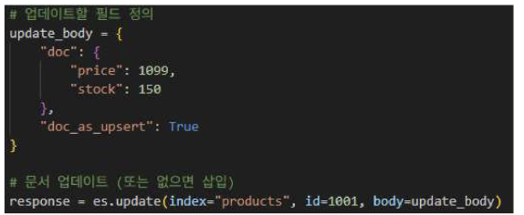

## 📌 Elastisearch 문서 업데이트
- 문서는 불변하므로 직접 수정되지 않으며, 업데이트 시 새로운 문서로 저장 등으로 사용 가능
- 업데이트 과정
    1. 기존 문서 조회 -> 업데이트 요청 시 현재 색인된 문서를 가져옴
    2. 변경 사항 적용 -> 기존 문서에 수정된 내용을 반영
    3. 새 문서 색인 -> 변경된 문서를 새로운 버전으로 다시 저장
    4. 이전 문서 삭제 처리 -> 기존 문서는 논리적 삭제(Logical Deletion)로 표시되어 검색에서 제외됨
    5. 세그먼트 병합 -> Segment Merging을 수행하여 삭제된 문서를 물리적으로 제거하고 저장 공간 확보

## 📌 Elastisearch에서 세그먼트와 Flush의 관계
1. upsert & update는 기존 문서를 수정하는 것이 아니라 새로운 세그먼트를 생성하는 방식으로 동작
    - Elasticsearch는 Lucene을 사용하며, 세그먼트는 수정될 수 없는 구조
    - 따라서 문서가 업데이트될 때 기존 세그먼트를 수정하지 않고 새로운 세그먼트를 생성

2. Flush는 새로운 세그먼트를 디스크에 기록하는 과정
    - 새로운 문서 추가(index), 업데이트(update), 삭제(delete)가 발생하면 메모리(Buffer)에 먼저 저장
    - Flush가 발생하면 메모리에 있던 문서들이 새로운 세그먼트로 생성되고 디스크에 저장됨

3. 세그먼트가 증가하면 자동으로 병합(Merge) 수행
    - 새로운 세그먼트가 많아지면 검색 속도가 느려질 수 있음
    - Elasticsearch는 주기적으로 여러 개의 작은 세그먼트를 하나로 병합하여 성능을 최적화